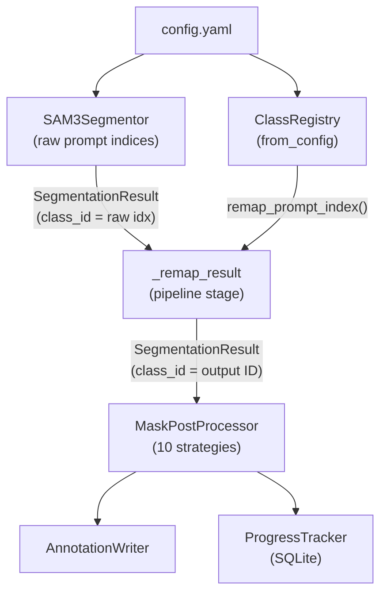
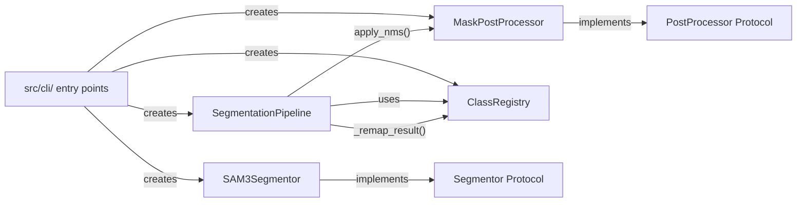
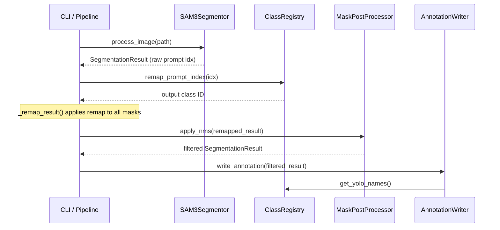
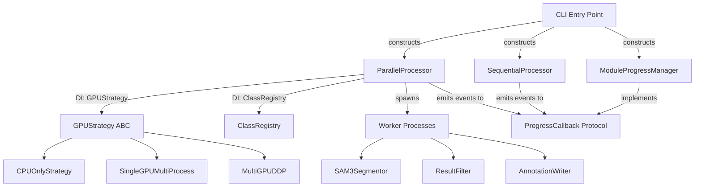
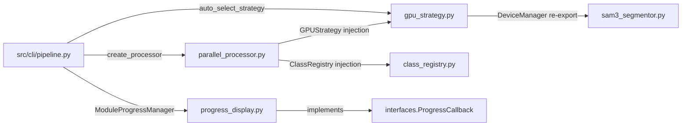
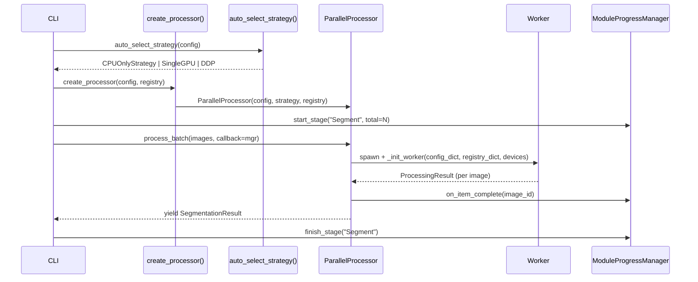
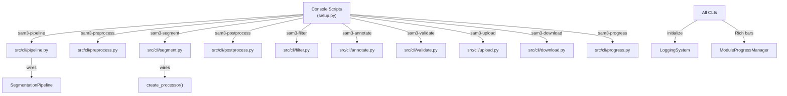
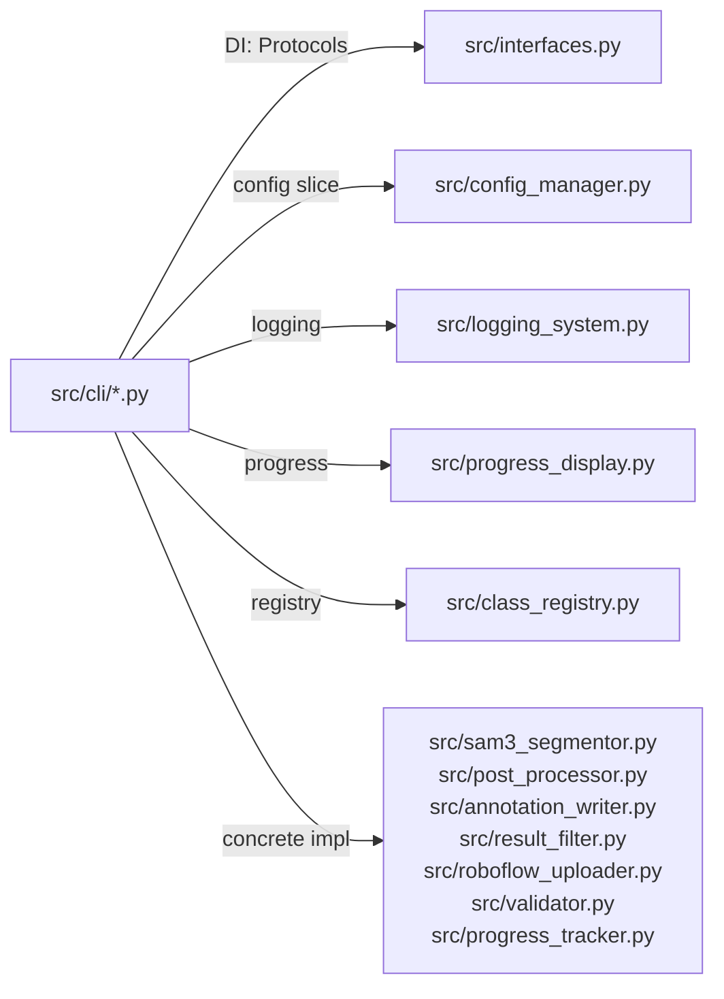
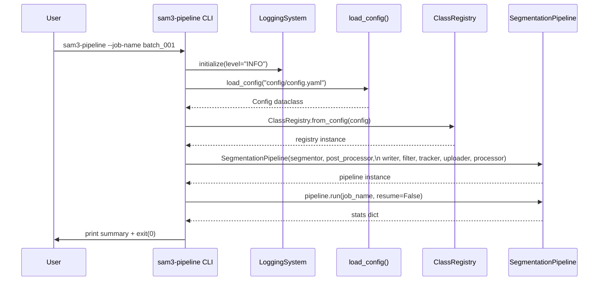

# SAM 3 Segmentation Pipeline

[](https://www.python.org/downloads/)
[](https://opensource.org/licenses/MIT)
[](https://github.com/psf/black)

> **Author:** Ahmed Hany ElBamby | **Created:** February 2026

Automated pipeline to process classroom images using SAM 3 (Segment Anything with Concepts) to segment and classify teachers/students, with distributed Roboflow uploads.

## ✨ Features

- **SAM 3 Integration**: Text-prompt based segmentation for "teacher" and "student" classes
- **NMS Post-Processing**: Mask-aware Non-Maximum Suppression to resolve overlapping annotations between classes
- **Auto Class Files**: Automatically generates `_classes.txt` and `classes.txt` for Roboflow compatibility
- **Resume Capability**: SQLite-based progress tracking for crash recovery
- **Distributed Uploads**: Async batch uploads to Roboflow (2000 images per batch)
- **Multi-Workspace Support**: Upload to multiple Roboflow workspaces with per-workspace API keys
- **Dataset Validation**: Compare input/output datasets and cache missing images for batch processing
- **YOLOv11 Format**: Polygon annotations compatible with Ultralytics training

## Requirements

- Python 3.9+
- SAM 3 model weights (`sam3.pt`)
- **CPU Mode**: 4+ cores, 16GB+ RAM (slower, but works without GPU)
- **GPU Mode**: NVIDIA GPU with CUDA (L4 or better recommended)

## Installation

```bash
# Create virtual environment
python -m venv venv
source venv/bin/activate  # Linux
# or: venv\Scripts\activate  # Windows

# Install dependencies
pip install -r requirements.txt

# Install Ultralytics CLIP fork (required for SAM 3)
pip install git+https://github.com/ultralytics/CLIP.git
```

## Model Setup

### Option 1: Automated Download (Recommended)

```bash
# Set your Hugging Face token
export HF_TOKEN=your_huggingface_token

# Download SAM 3 model
python scripts/download_model.py

# Or pass token directly
python scripts/download_model.py --token your_huggingface_token

# Check download status
python scripts/download_model.py --status
```

### Option 2: Manual Download

1. Request access at [HuggingFace SAM 3](https://huggingface.co/facebook/sam3)
2. Download `sam3.pt` once approved
3. Place in `models/` directory

## Configuration

Edit `config/config.yaml`:

```yaml
pipeline:
  input_dir: "/path/to/your/images"
  output_dir: "./output/dataset"
  input_mode: "pre-split"  # "pre-split" or "flat"
  resolution: 1024

model:
  path: "./models/sam3.pt"
  prompts: ["teacher", "student"]

roboflow:
  enabled: true
  workspaces:
    - workspace: "your-workspace"
      api_key: "${ROBOFLOW_API_KEY}"
      projects:
        - project: "your-project"
          is_prediction: true
```

### Input Modes

- **pre-split** (default): Input directory has `train/`, `valid/`, `test/` subdirectories
- **flat**: All images in one directory, splits assigned randomly per config ratios

### Device Options

```yaml
model:
  device: "auto"   # Auto-detect best available device
  # device: "cpu"  # CPU only (4+ cores, 16GB RAM)
  # device: "cuda" # First available GPU
  # device: "cuda:0"  # Specific GPU
```

> **Note**: FP16 (`half_precision: true`) is auto-disabled on CPU.

### Post-Processing (NMS)

```yaml
post_processing:
  enabled: true
  iou_threshold: 0.5
  strategy: "confidence"  # confidence, area, class_priority, soft_nms
  class_priority: ["teacher", "student"]
  soft_nms_sigma: 0.5
  min_confidence_after_decay: 0.1
```

---

## NMS Strategies - Detailed Guide

Non-Maximum Suppression (NMS) is applied to resolve overlapping segmentation masks between different classes. The pipeline supports 4 distinct strategies, each suited for different use cases.

### How NMS Works

1. **Mask IoU Calculation**: For each pair of masks, calculate the Intersection over Union (IoU)
2. **Overlap Detection**: If IoU exceeds `iou_threshold`, masks are considered overlapping
3. **Suppression Decision**: Apply the selected strategy to decide which mask to keep/suppress

```
        ┌─────────────────────────────────────────────────────────────┐
        │                    NMS Processing Flow                       │
        └─────────────────────────────────────────────────────────────┘
                                    │
                    ┌───────────────▼───────────────┐
                    │  Sort masks by confidence     │
                    │  (highest first)              │
                    └───────────────┬───────────────┘
                                    │
                    ┌───────────────▼───────────────┐
                    │  For each mask pair:          │
                    │  Calculate IoU                │
                    └───────────────┬───────────────┘
                                    │
                      ┌─────────────▼─────────────┐
                      │   IoU > threshold?        │
                      └─────────────┬─────────────┘
                            │               │
                           YES              NO
                            │               │
              ┌─────────────▼────────┐     └──► Keep both masks
              │ Apply Strategy:      │
              │ confidence / area /  │
              │ class_priority /     │
              │ soft_nms             │
              └──────────────────────┘
```

---

### Strategy 1: `confidence` (Default, Recommended)

**How it works**: When two masks overlap, keep the mask with **higher confidence score**.

**Best for**: General use cases where model confidence is a reliable indicator of detection quality.

```yaml
post_processing:
  enabled: true
  iou_threshold: 0.5
  strategy: "confidence"
```

**Example Scenario**:
```
Image: Classroom with teacher and student standing close together

Detection 1: Teacher mask (confidence: 0.92)
Detection 2: Student mask (confidence: 0.78)
IoU between masks: 0.65 (> 0.5 threshold)

Result: Keep Teacher mask (0.92 > 0.78), suppress Student mask
```

**When to use**:
- ✅ Model is well-calibrated (higher confidence = better detection)
- ✅ You trust the model's confidence scores
- ✅ No specific class preference needed

---

### Strategy 2: `area`

**How it works**: When two masks overlap, keep the **larger mask** (by pixel area).

**Best for**: Scenarios where larger objects should take priority, or when confidence scores are unreliable.

```yaml
post_processing:
  enabled: true
  iou_threshold: 0.5
  strategy: "area"
```

**Example Scenario**:
```
Image: Teacher partially occluding a student

Detection 1: Teacher mask - 50,000 pixels (confidence: 0.75)
Detection 2: Student mask - 25,000 pixels (confidence: 0.88)
IoU between masks: 0.55

Result: Keep Teacher mask (50,000 > 25,000 pixels), suppress Student mask
         (despite Student having higher confidence!)
```

**When to use**:
- ✅ Larger objects are more important in your dataset
- ✅ Confidence scores are noisy or unreliable
- ✅ You want to prioritize fully-visible subjects over partial occlusions

---

### Strategy 3: `class_priority`

**How it works**: When two masks overlap, keep the mask belonging to the **higher priority class** (defined in config).

**Best for**: Datasets where certain classes are more important than others.

```yaml
post_processing:
  enabled: true
  iou_threshold: 0.5
  strategy: "class_priority"
  class_priority: ["teacher", "student"]  # teacher has higher priority
```

**Example Scenario**:
```
Image: Teacher and student overlapping

Detection 1: Student mask (confidence: 0.95)  - Class index 1
Detection 2: Teacher mask (confidence: 0.70)  - Class index 0
IoU between masks: 0.60

class_priority: ["teacher", "student"]
  → teacher is at index 0 (higher priority)
  → student is at index 1 (lower priority)

Result: Keep Teacher mask (despite lower confidence!), suppress Student mask
```

**When to use**:
- ✅ Certain classes are more valuable for your use case
- ✅ You want guaranteed detection of specific classes
- ✅ Class hierarchy is more important than confidence

**Priority Order**: First item in the list has **highest priority**.
```yaml
# Teachers always kept over students
class_priority: ["teacher", "student"]

# Students always kept over teachers (reversed)
class_priority: ["student", "teacher"]
```

---

### Strategy 4: `soft_nms`

**How it works**: Instead of completely removing overlapping masks, **gradually decay their confidence** based on IoU. Masks are only removed if confidence drops below `min_confidence_after_decay`.

**Best for**: Dense scenes with many overlapping objects where hard suppression loses too many valid detections.

```yaml
post_processing:
  enabled: true
  iou_threshold: 0.5
  strategy: "soft_nms"
  soft_nms_sigma: 0.5              # Controls decay rate (lower = more aggressive)
  min_confidence_after_decay: 0.1  # Minimum confidence to keep
```

**Decay Formula**:
```
new_confidence = original_confidence × exp(-(IoU²) / sigma)
```

**Example Scenario**:
```
Image: Crowded classroom with multiple students standing close

Detection 1: Student A (confidence: 0.90)
Detection 2: Student B (confidence: 0.85)
Detection 3: Student C (confidence: 0.75)

IoU(A,B) = 0.55 → B decayed: 0.85 × exp(-(0.55²)/0.5) = 0.85 × 0.54 = 0.46
IoU(A,C) = 0.30 → C not processed (below threshold)
IoU(B,C) = 0.60 → C decayed: 0.75 × exp(-(0.60²)/0.5) = 0.75 × 0.49 = 0.37

Final: Keep A (0.90), B (0.46), C (0.37) - all above 0.1 threshold
       With hard NMS, B and C would have been completely removed!
```

**When to use**:
- ✅ Dense scenes with many valid overlapping objects
- ✅ Hard suppression removes too many valid detections
- ✅ You want to preserve more annotations with adjusted confidence

**Tuning `soft_nms_sigma`**:
| Sigma | Effect |
|-------|--------|
| 0.3   | Aggressive decay, more masks removed |
| 0.5   | Balanced (default) |
| 0.8   | Gentle decay, more masks preserved |

---

### Strategy Comparison Table

| Strategy | Suppression Type | Decision Criteria | Best For |
|----------|-----------------|-------------------|----------|
| `confidence` | Hard | Higher confidence wins | General use, well-calibrated models |
| `area` | Hard | Larger mask wins | Prioritizing fully-visible subjects |
| `class_priority` | Hard | Priority class wins | Important class detection |
| `soft_nms` | Soft (decay) | Gradual confidence reduction | Dense scenes, crowded images |

### Quick Decision Guide

```
                     Which NMS Strategy Should I Use?
                                  │
                ┌─────────────────▼─────────────────┐
                │   Are certain classes more        │
                │   important than others?          │
                └─────────────────┬─────────────────┘
                        │                   │
                       YES                  NO
                        │                   │
                        ▼                   │
            Use: class_priority             │
                                            ▼
                            ┌───────────────────────────┐
                            │  Is the scene crowded     │
                            │  with many overlaps?      │
                            └─────────────┬─────────────┘
                                    │           │
                                   YES          NO
                                    │           │
                                    ▼           │
                          Use: soft_nms         │
                                                ▼
                                ┌───────────────────────────┐
                                │  Are confidence scores    │
                                │  reliable?                │
                                └─────────────┬─────────────┘
                                        │           │
                                       YES          NO
                                        │           │
                                        ▼           ▼
                              Use: confidence    Use: area
```

---


## Module Use Cases

### 1. Pipeline Module (`run_pipeline.py`)

The main segmentation pipeline for processing images.

#### Use Case: Start a New Segmentation Job
```bash
python scripts/run_pipeline.py --job-name "classroom_batch_001"
```
Processes all images in `input_dir`, generates annotations in `output_dir`.

#### Use Case: Resume an Interrupted Job
```bash
python scripts/run_pipeline.py --resume --job-name "classroom_batch_001"
```
Continues from where it left off after crash or manual stop.

#### Use Case: Check Job Progress
```bash
python scripts/run_pipeline.py --status --job-name "classroom_batch_001"
```
Shows processed/pending/error counts per split.

#### Use Case: Reset and Retry Failed Images
```bash
# Reset images stuck in "processing" state
python scripts/run_pipeline.py --reset-stuck --job-name "classroom_batch_001"

# Reset images with errors for retry
python scripts/run_pipeline.py --reset-errors --job-name "classroom_batch_001"

# Then resume
python scripts/run_pipeline.py --resume --job-name "classroom_batch_001"
```

#### Use Case: Force Full Rescan
```bash
python scripts/run_pipeline.py --force-scan --job-name "new_batch"
```
Ignores cache and rescans input directory.

#### Use Case: Retry Failed Roboflow Uploads
```bash
python scripts/run_pipeline.py --retry-uploads --job-name "classroom_batch_001"
```

---

### 2. Validator Module (`run_validator.py`)

Compares input/output datasets to find missing images and cache them for batch processing.

> [!NOTE]
> The validator also checks the `neither/` folder in the output directory. Images placed in `neither/` (those with no detections) are considered **processed** and will not be counted as missing.

#### Use Case: Validate Dataset Completeness
```bash
python scripts/run_validator.py --validate
```
Compares input images vs output annotations, shows report with missing counts.

#### Use Case: Cache Missing Images for Later Processing
```bash
python scripts/run_validator.py --validate --cache --job-name "missing_batch_1"
```
Stores missing image paths in database for batch re-processing.

#### Use Case: View All Cached Validation Jobs
```bash
python scripts/run_validator.py --show-cached
```
Lists all validation jobs with pending/processed counts.

#### Use Case: View Cached Images for a Specific Job
```bash
python scripts/run_validator.py --show-cached --job-name "missing_batch_1" --verbose
```
Shows individual file paths for the cached job.

#### Use Case: Process Cached Missing Images
```bash
# First cache missing images
python scripts/run_validator.py --validate --cache --job-name "missing_batch_1"

# Then run pipeline to process them
python scripts/run_pipeline.py --job-name "missing_batch_1" --resume
```

#### Use Case: Clear Validation Cache
```bash
python scripts/run_validator.py --clear-cache --job-name "missing_batch_1" --force
```

---

### Complete Workflow: Process Only Missing Images

This workflow validates your dataset, identifies missing annotations, and processes only those images.

#### Step 1: Validate Dataset
```bash
# Compare input vs output to find missing images
python scripts/run_validator.py --validate
```

**Expected output:**
```
VALIDATION RESULTS
==================================================
Input images:  100000
Output images: 95000
Missing:       5000

Missing by split:
  train: 3500
  valid: 1000
  test: 500
==================================================
```

#### Step 2: Cache Missing Images
```bash
# Store missing images in database for batch processing
python scripts/run_validator.py --validate --cache --job-name "missing_batch_1"
```

This saves the 5,000 missing image paths to the SQLite database.

#### Step 3: Create Pipeline Job from Cached Images
```bash
# Run the pipeline - it will use cached images as input
python scripts/run_pipeline.py --job-name "missing_batch_1"
```

> **Note**: When a job name matches a validation cache, the pipeline automatically processes only those cached images.

#### Step 4: Verify Completion
```bash
# Check if all missing images are now processed
python scripts/run_validator.py --validate

# Expected: Missing: 0
```

#### Alternative: Manual Batch Processing

If you prefer to process in smaller batches:

```bash
# 1. Cache all missing images
python scripts/run_validator.py --validate --cache --job-name "missing_all"

# 2. Check how many are cached
python scripts/run_validator.py --show-cached --job-name "missing_all"

# 3. Run pipeline (it will process all cached images)
python scripts/run_pipeline.py --job-name "missing_all"

# 4. If interrupted, resume
python scripts/run_pipeline.py --job-name "missing_all" --resume
```

#### Troubleshooting: No Input Images Found

If the validator shows `Input images: 0`:

1. **Check config paths** - Ensure `input_dir` in `config/config.yaml` points to an existing directory
2. **Check input mode** - For `pre-split` mode, verify `train/`, `valid/`, `test/` subdirectories exist
3. **Check file formats** - Ensure images match `supported_formats` in config (`.jpg`, `.png`, etc.)

---

### 3. Model Downloader (`download_model.py`)

Downloads SAM 3 model weights from Hugging Face.

#### Use Case: Download Model with Environment Token
```bash
export HF_TOKEN=your_huggingface_token
python scripts/download_model.py
```

#### Use Case: Download with Direct Token
```bash
python scripts/download_model.py --token hf_xxxxxxxxxxxx
```

#### Use Case: Check Model Download Status
```bash
python scripts/download_model.py --status
```
Shows if model exists and file size.

#### Use Case: Force Re-download
```bash
python scripts/download_model.py --force
```

---

### 4. Class Files Script (`add_class_files.py`)

Adds class name files for Roboflow compatibility (legacy datasets only).

#### Use Case: Fix Missing Class Files
```bash
python scripts/add_class_files.py
```
Generates `_classes.txt` in each split folder and `classes.txt` at root.

> **Note**: New pipeline runs generate these automatically.

---

### 5. Config Manager (`src/config_manager.py`)

Programmatic configuration loading and validation.

#### Use Case: Load Config in Custom Scripts
```python
from src.config_manager import load_config, validate_config

config = load_config("config/config.yaml")
warnings = validate_config(config)

print(f"Input: {config.pipeline.input_dir}")
print(f"Model: {config.model.path}")
```

#### Use Case: Override Config at Runtime
```python
config = load_config("config/config.yaml")
config.model.device = "cuda:1"  # Use second GPU
config.pipeline.num_workers = 8  # More parallel workers
```

---

### 6. Progress Tracker (`src/progress_tracker.py`)

SQLite-based job and image status tracking.

#### Use Case: Query Job Progress Programmatically
```python
from src.progress_tracker import ProgressTracker
from pathlib import Path

tracker = ProgressTracker(Path("db/progress.db"))
job_id = tracker.get_job_id("my_job")
progress = tracker.get_progress(job_id)

print(f"Processed: {progress['processed_count']}/{progress['total_images']}")
tracker.close()
```

#### Use Case: Get Progress by Split
```python
split_progress = tracker.get_progress_by_split(job_id)
for split, stats in split_progress.items():
    print(f"{split}: {stats.get('completed', 0)} done, {stats.get('pending', 0)} pending")
```

---

### 7. Annotation Writer (`src/annotation_writer.py`)

Writes YOLOv11 polygon annotations.

#### Use Case: Write Annotations Programmatically
```python
from src.annotation_writer import AnnotationWriter

writer = AnnotationWriter(config)
label_path = writer.write_annotation(
    image_path=Path("input/train/img001.jpg"),
    result=segmentation_result,
    split="train",
    copy_image=True
)
writer.write_data_yaml()
```

#### Use Case: Get Annotation Statistics
```python
stats = writer.get_stats()
for split, data in stats.items():
    print(f"{split}: {data['images']} images, {data['annotations']} annotations")
```

---

### 8. Post Processor (`src/post_processor.py`)

Mask-aware NMS to resolve overlapping annotations.

#### Use Case: Apply NMS to Segmentation Results
```python
from src.post_processor import PostProcessor

processor = PostProcessor(config)
filtered_result = processor.process(raw_segmentation_result)
```

#### Use Case: Switch NMS Strategy
```yaml
# In config.yaml
post_processing:
  strategy: "soft_nms"  # Gradual confidence decay instead of removal
  soft_nms_sigma: 0.5
```

---

### 9. Roboflow Uploader (`src/roboflow_uploader.py`)

Distributed async uploads to Roboflow.

#### Use Case: Manual Batch Upload
```python
from src.roboflow_uploader import DistributedUploader

uploader = DistributedUploader(config, tracker, job_id)
uploader.queue_batch(output_dir, batch_id=1)
uploader.wait_for_uploads()
stats = uploader.get_stats()
print(f"Uploaded: {stats['completed']}, Failed: {stats['failed']}")
```

---

### 10. Dataset Cache (`src/dataset_cache.py`)

Caches dataset scans to avoid rescanning unchanged directories.

#### Use Case: Check Cache Status
```python
from src.dataset_cache import DatasetCache

cache = DatasetCache()
info = cache.get_cache_info(Path("/path/to/dataset"))
if info:
    print(f"Cached: {info['total_files']} files, {info['total_size_mb']:.1f} MB")
```

#### Use Case: Invalidate Cache
```python
cache.invalidate_cache(Path("/path/to/dataset"))
```

---

## Output Structure

```
output/dataset/
├── train/
│   ├── images/
│   ├── labels/
│   └── _classes.txt
├── valid/
│   ├── images/
│   ├── labels/
│   └── _classes.txt
├── test/
│   ├── images/
│   ├── labels/
│   └── _classes.txt
├── neither/               # Images with no detections
│   ├── images/
│   └── manifest.txt
├── classes.txt
└── data.yaml              # YOLOv11 dataset config
```

## Database Schema

The pipeline uses SQLite for progress tracking:

- **jobs**: Processing job metadata
- **images**: Per-image status (pending/processing/completed/error)
- **batches**: Upload batch tracking
- **validation_cache**: Missing images cache for validator

## 📁 Project Structure

```
SAM Segmentation Project/
├── config/               # Configuration files
│   ├── config.yaml       # Main pipeline configuration
│   └── doc.md            # Configuration documentation
├── src/                  # Core Python modules
│   ├── pipeline.py       # Main orchestrator
│   ├── sam3_segmentor.py # SAM 3 model wrapper
│   ├── post_processor.py # NMS implementation
│   ├── annotation_writer.py
│   ├── roboflow_uploader.py
│   └── doc.md            # Source documentation
├── scripts/              # CLI entry points
│   ├── run_pipeline.py   # Main script
│   ├── run_validator.py  # Dataset validation
│   ├── download_model.py # Model download
│   └── doc.md            # Scripts documentation
├── tests/                # Unit tests
│   └── doc.md            # Tests documentation
├── models/               # SAM 3 model weights
├── db/                   # SQLite progress database
├── logs/                 # Pipeline logs
└── output/               # Generated annotations
```

## 🤝 Contributing

Contributions are welcome! Please follow these steps:

1. **Fork** the repository
2. **Create** a feature branch (`git checkout -b feature/amazing-feature`)
3. **Commit** your changes (`git commit -m 'Add amazing feature'`)
4. **Push** to the branch (`git push origin feature/amazing-feature`)
5. **Open** a Pull Request

### Code Style

- Follow [PEP 8](https://pep8.org/) conventions
- Add docstrings to all public functions and classes
- Include author headers in new files:
  ```python
  """
  Module description.
  
  Author: Your Name
  Date: MM-DD-YYYY
  """
  ```

### Running Tests

```bash
# Run all tests
pytest tests/ -v

# Run with coverage
pytest tests/ --cov=src --cov-report=html
```

---

## Development Reports

### Phase 1 — Logging System & Interfaces (Agent A)

**Date:** 22-02-2026  
**Author:** Agent A — Infrastructure  
**Status:** Delivered ✅

#### Summary
Created `src/logging_system.py` (singleton Rich + JSON logger, `@trace` decorator, correlation IDs) and `src/interfaces.py` (all Protocol definitions, `MaskData`, `SegmentationResult`, `ProcessingStats` data structures).  57 unit tests written and passing.

---

### Phase 2 — ClassRegistry + NMS Strategy Pattern + Config Updates (Agent B)

**Date:** 22-02-2026  
**Author:** Agent B — Core Pipeline  
**Status:** Delivered ✅

#### Summary

Implemented the four Phase 2 modules per the delivery gate requirements:

1. **`src/class_registry.py`** — Single source of truth for class names, IDs, and many-to-one prompt→output remapping.  Eliminates all hardcoded `["teacher", "student"]` lists.
2. **`src/post_processor.py`** — Full OCP rewrite with 10 NMS strategies via `NMSStrategy` ABC + `NMSStrategyFactory` registry.  Decoupled from the segmentor.
3. **`src/sam3_segmentor.py`** — Refactored to return `interfaces.SegmentationResult` with raw prompt indices (no NMS, no hardcoded class names).
4. **`src/pipeline.py`** — Added DI constructor, explicit `_remap_result()` pipeline stage, and `ClassRegistry` integration.

Config manager updated with `LoggingConfig`, `GPUConfig`, `class_remapping` field, and extended `PostProcessingConfig` (10 strategy config fields).

#### Architecture Diagram



#### Module Dependency Diagram



#### Files Modified / Created

| File | Action | Description |
|------|--------|-------------|
| `src/class_registry.py` | Created | ClassRegistry — 290 lines, full many-to-one remap, IPC serialisation |
| `src/post_processor.py` | Replaced | 355 lines — 10 NMS strategies via Strategy Pattern, OCP-compliant |
| `src/sam3_segmentor.py` | Replaced | 389 lines — decoupled from NMS, returns `interfaces.SegmentationResult` |
| `src/pipeline.py` | Modified | Added DI constructor, `_remap_result()` static method, ClassRegistry integration |
| `src/config_manager.py` | Modified | Added `LoggingConfig`, `GPUConfig`, `class_remapping`, extended `PostProcessingConfig` |
| `src/class_registry.md` | Created | Module documentation |
| `src/post_processor.md` | Created | Module documentation |
| `src/sam3_segmentor.md` | Created | Module documentation |
| `src/pipeline.md` | Created | Module documentation |
| `tests/test_class_registry.py` | Created | 51 unit tests — all passing |
| `tests/test_post_processor.py` | Created | 52 unit tests — all passing |
| `tests/integration/__init__.py` | Created | Integration tests package |
| `tests/integration/test_segment_remap_nms.py` | Created | 9 integration tests — all passing |

#### Key Design Decisions

- **Remap before NMS (mandatory):** `_remap_result()` is a static pipeline method that wraps `ClassRegistry.remap_prompt_index()`.  It is called between the segment and NMS stages, never inside either.
- **OCP for NMS strategies:** `@NMSStrategyFactory.register("name")` decorator self-registers strategies without modifying the factory.  New strategies require zero changes to existing code.
- **ISP for config:** `SAM3Segmentor` receives `model_config` and `pipeline_config` slices, not the full `Config`.  `MaskPostProcessor` receives `PostProcessingConfig` only.
- **IPC serialisation:** `ClassRegistry.to_dict()` / `from_dict()` enable safe transfer across `multiprocessing` process boundaries.

#### Protocol Compliance

- `SAM3Segmentor` implements `Segmentor` protocol
- `MaskPostProcessor` implements `PostProcessor` protocol — verified by `isinstance(p, PostProcessor)` test
- `SegmentationPipeline` constructor accepts `PostProcessor`, `Tracker`, `Uploader` abstract types

#### Test Results

```
pytest tests/test_class_registry.py -v
========================= 51 passed in 0.23s =========================

pytest tests/test_post_processor.py -v
========================= 52 passed in 0.41s =========================

pytest tests/integration/test_segment_remap_nms.py -v
========================= 9 passed in 0.31s =========================

pytest tests/ tests/integration/ --tb=no -q
3 failed (pre-existing), 206 passed, 15 warnings in 0.68s
```

The 3 failures are pre-existing `val`/`valid` dir bugs in `test_annotation_writer.py` — not introduced in Phase 2.

#### Integration Points



#### Known Limitations / TODOs

- `DeviceManager` still lives in `sam3_segmentor.py` — migrates to `src/gpu_strategy.py` in Phase 3
- `pipeline.py`'s `run()` remains 200+ lines — full thin-orchestrator refactor deferred to Phase 4 CLI work
- Pre-existing test bugs in `test_annotation_writer.py` (`val` vs `valid`, `names` list vs dict) — fix in Phase 5

---

### Phase 3 — `gpu_strategy`, `progress_display`, `parallel_processor` refactor (Agent B)

**Date:** 23-02-2026  
**Author:** Agent B — GPU Strategy & Progress Display  
**Status:** Delivered ✅

#### Summary

Phase 3 migrated `DeviceManager` out of `sam3_segmentor.py`, introduced an OCP-compliant
`GPUStrategy` ABC with three concrete strategies, added a Rich-based ephemeral progress
display (`ModuleProgressManager`), and fully refactored `parallel_processor.py` to use
constructor injection with no global mutable state. 103 new tests added; total suite
remains at 309 passing with the same 3 pre-existing failures.

#### Architecture Diagram



#### Module Dependency Diagram



#### Files Modified / Created

| File | Action | Description |
|------|--------|-------------|
| `src/gpu_strategy.py` | Created | GPUStrategy ABC, 3 strategies, DeviceManager, auto_select_strategy |
| `src/progress_display.py` | Created | ModuleProgressManager + StageProgress + PIPELINE_STAGES |
| `src/parallel_processor.py` | Refactored | DI pattern, no global state, Protocol compliant |
| `src/sam3_segmentor.py` | Modified | Removed DeviceManager class; imports from gpu_strategy |
| `src/gpu_strategy.md` | Created | Module documentation |
| `src/progress_display.md` | Created | Module documentation |
| `src/parallel_processor.md` | Created | Module documentation |
| `tests/test_gpu_strategy.py` | Created | 47 unit tests — all passing |
| `tests/test_progress_display.py` | Created | 40 unit tests — all passing |
| `tests/integration/test_gpu_processor.py` | Created | 16 integration tests — all passing |

#### Key Design Decisions

- **Strategy Pattern (OCP):** `GPUStrategy` ABC — adding a new GPU strategy requires only a new subclass. No modifications to factory or existing strategies.
- **No global mutable state:** `_worker_state` lives in each subprocess's own memory (spawn semantics). Workers are stateless from the main process's perspective.
- **IPC-safe serialisation:** `Config.to_dict()` + `ClassRegistry.to_dict()` pass only plain Python dicts through `ProcessPoolExecutor` `initargs`.
- **Lazy imports in workers:** `SAM3Segmentor`, `ResultFilter`, `AnnotationWriter` imported inside `_init_worker()` — avoids CUDA context creation in the main process.
- **DeviceManager migration:** Moved to `gpu_strategy.py` (canonical device-management location). `sam3_segmentor.py` re-exports via `from .gpu_strategy import DeviceManager` for backward compatibility.

#### Protocol Compliance

- `ModuleProgressManager` implements `ProgressCallback` (verified via `isinstance` in integration tests)
- `ParallelProcessor` implements `Processor` (verified via `isinstance` in integration tests)
- `SequentialProcessor` implements `Processor` (verified via `isinstance` in integration tests)
- `GPUStrategy` is an ABC — concrete subclasses verified in unit tests

#### Test Results

```
pytest tests/test_gpu_strategy.py -v
========================= 47 passed in 1.86s =========================

pytest tests/test_progress_display.py -v
========================= 40 passed in 0.98s =========================

pytest tests/integration/test_gpu_processor.py -v
========================= 16 passed in 1.12s =========================

pytest tests/ tests/integration/ --tb=no -q
309 passed, 3 failed (pre-existing), 15 warnings in 2.71s
```

#### Integration Points



#### Known Limitations / TODOs

- `pipeline.py` `run()` still bypasses `ParallelProcessor` (uses its own loop) — Phase 4 CLI wiring will fix this
- `ResultFilter` and `AnnotationWriter` still receive full `config` (not slices) — ISP cleanup in Phase 5
- Pre-existing `val` vs `valid` test failures in `test_annotation_writer.py` — Phase 5

---

### Phase 4 — CLI Entry Points & Config Slicing (Agent D)

**Date:** 23-02-2026  
**Author:** Agent D — UI/CLI  
**Status:** Delivered ✅

#### Summary

Implemented all 10 `sam3-*` console-script entry points in `src/cli/`, registered them in `setup.py`,
wrote 52 unit tests, and produced companion documentation for every file. Each entry point:

- Calls `LoggingSystem.initialize()` FIRST, before any other operation
- Loads only the config slice(s) its stage uses (ISP compliance)
- Wires concrete classes with Protocol types — DIP compliance
- Uses `ModuleProgressManager` for ephemeral Rich progress bars
- Returns exit code `0` on success, `1` on error

#### Architecture Diagram



#### Module Dependency Diagram



#### Files Modified / Created

| File | Action | Description |
|------|--------|-------------|
| `src/cli/__init__.py` | Created | CLI package init listing all 10 modules |
| `src/cli/pipeline.py` | Created | `sam3-pipeline` — full DI-wired pipeline orchestration |
| `src/cli/preprocess.py` | Created | `sam3-preprocess` — scan/validate images via `ImagePreprocessor` |
| `src/cli/segment.py` | Created | `sam3-segment` — batch inference via `create_processor()` |
| `src/cli/postprocess.py` | Created | `sam3-postprocess` — NMS config validation + strategy override |
| `src/cli/filter.py` | Created | `sam3-filter` — audit label files, move no-detection images |
| `src/cli/annotate.py` | Created | `sam3-annotate` — write `data.yaml` via `AnnotationWriter` |
| `src/cli/validate.py` | Created | `sam3-validate` — compare datasets via `Validator.compare_datasets()` |
| `src/cli/upload.py` | Created | `sam3-upload` — queue Roboflow batches via `DistributedUploader` |
| `src/cli/download.py` | Created | `sam3-download` — download SAM3 weights from HuggingFace Hub |
| `src/cli/progress.py` | Created | `sam3-progress` — display SQLite job progress |
| `src/cli/pipeline.md` | Created | CLI pipeline documentation |
| `src/cli/preprocess.md` | Created | CLI preprocess documentation |
| `src/cli/segment.md` | Created | CLI segment documentation |
| `src/cli/postprocess.md` | Created | CLI postprocess documentation |
| `src/cli/filter.md` | Created | CLI filter documentation |
| `src/cli/annotate.md` | Created | CLI annotate documentation |
| `src/cli/validate.md` | Created | CLI validate documentation |
| `src/cli/upload.md` | Created | CLI upload documentation |
| `src/cli/download.md` | Created | CLI download documentation |
| `src/cli/progress.md` | Created | CLI progress documentation |
| `setup.py` | Modified | Replaced 1 legacy entry with 11 console_scripts |
| `tests/test_cli.py` | Created | 52 unit tests — all passing |

#### Console Scripts (setup.py)

| Command | Module | Stage |
|---------|--------|-------|
| `sam3-pipeline` | `src.cli.pipeline:main` | Full end-to-end pipeline |
| `sam3-preprocess` | `src.cli.preprocess:main` | Image scan + validation |
| `sam3-segment` | `src.cli.segment:main` | SAM3 inference |
| `sam3-postprocess` | `src.cli.postprocess:main` | NMS post-processing |
| `sam3-filter` | `src.cli.filter:main` | Empty-detection filtering |
| `sam3-annotate` | `src.cli.annotate:main` | YOLO annotation writing |
| `sam3-validate` | `src.cli.validate:main` | Dataset completeness check |
| `sam3-upload` | `src.cli.upload:main` | Roboflow batch upload |
| `sam3-download` | `src.cli.download:main` | Model weight download |
| `sam3-progress` | `src.cli.progress:main` | Job progress display |
| `sam3-pipeline-legacy` | `scripts.run_pipeline:main` | Legacy wrapper (backward compat) |

#### Key Design Decisions

- **LoggingSystem FIRST:** Every `main()` calls `LoggingSystem.initialize()` before `load_config()` or any I/O. This ensures all exceptions during config load are captured with JSON context.
- **Config slicing (ISP):** Each CLI passes only the relevant config sub-object to its module constructor (e.g., `MaskPostProcessor(post_processing_config)`, not `MaskPostProcessor(config)`).
- **Concrete wiring in CLI only (DIP):** Concrete class instantiation — `SAM3Segmentor(...)`, `AnnotationWriter(...)`, etc. — occurs exclusively in `src/cli/` entry points. Core modules accept Protocols.
- **API correctness:** Discovered and fixed three API mismatches during impl: `tracker.reset_processing_images()` (not `reset_stuck_images()`), `validator.compare_datasets()` (not `validate()`), `uploader.queue_batch()` (not `upload_batch()`).
- **Windows MagicMock tests:** CLI tests for segment used `input_dir.rglob.return_value = []` on the MagicMock config rather than patching `Path.__truediv__` (read-only attribute on Windows).

#### Protocol Compliance

- `sam3-pipeline`: wires `SegmentationPipeline` with `Segmentor`, `PostProcessor`, `Writer`, `Filter`, `Tracker`, `Uploader`, `Processor` — all Protocol types
- `sam3-segment`: calls `create_processor()` factory → returned `Processor` instance (ISP-compliant)
- `sam3-validate`: consumes `Validator` via its public API (no internal attribute access)
- `sam3-upload`: consumes `DistributedUploader` via its public API

#### Test Results

```
pytest tests/test_cli.py -v
========================= 52 passed in 0.75s =========================

pytest tests/ tests/integration/ --tb=no -q
361 passed, 3 failed (pre-existing val/valid bug), 15 warnings in 4.47s
```

#### Integration Points



#### Known Limitations / TODOs

- `pipeline.py` `run()` still ~200 lines — thin-orchestrator refactor deferred to Phase 5
- `ResultFilter` and `AnnotationWriter` receive full `config` (not thin slices) — ISP cleanup in Phase 5
- Pre-existing `val` vs `valid` test failures in `test_annotation_writer.py` — Phase 5

---

## 📄 License

MIT License

Copyright (c) 2026 Ahmed Hany ElBamby

Permission is hereby granted, free of charge, to any person obtaining a copy
of this software and associated documentation files (the "Software"), to deal
in the Software without restriction, including without limitation the rights
to use, copy, modify, merge, publish, distribute, sublicense, and/or sell
copies of the Software, and to permit persons to whom the Software is
furnished to do so, subject to the following conditions:

The above copyright notice and this permission notice shall be included in all
copies or substantial portions of the Software.

THE SOFTWARE IS PROVIDED "AS IS", WITHOUT WARRANTY OF ANY KIND, EXPRESS OR
IMPLIED, INCLUDING BUT NOT LIMITED TO THE WARRANTIES OF MERCHANTABILITY,
FITNESS FOR A PARTICULAR PURPOSE AND NONINFRINGEMENT. IN NO EVENT SHALL THE
AUTHORS OR COPYRIGHT HOLDERS BE LIABLE FOR ANY CLAIM, DAMAGES OR OTHER
LIABILITY, WHETHER IN AN ACTION OF CONTRACT, TORT OR OTHERWISE, ARISING FROM,
OUT OF OR IN CONNECTION WITH THE SOFTWARE OR THE USE OR OTHER DEALINGS IN THE
SOFTWARE.
