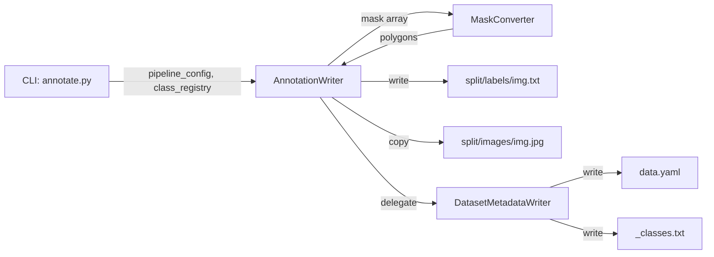

# annotation_writer

## Purpose

Writes per-image YOLOv11 segmentation polygon annotations and dataset metadata files.
Implements SRP by splitting responsibilities into three classes:
- **`MaskConverter`** — binary mask ↔ normalised polygon geometry
- **`DatasetMetadataWriter`** — `data.yaml` and `_classes.txt` dataset-level metadata
- **`AnnotationWriter`** — per-image TXT label writing + directory setup; delegates to the above

## Public API

### `MaskConverter`

| Method | Signature | Description |
|--------|-----------|-------------|
| `mask_to_polygon` | `(mask, simplify_epsilon=0.001) → List[float]` | Single mask → normalised `[x1,y1,…]` polygon |
| `masks_to_polygons` | `(masks: ndarray(N,H,W), class_ids: List[int]) → List[Tuple[int, List[float]]]` | Batch convert + zip with class IDs |

### `DatasetMetadataWriter`

| Method | Signature | Description |
|--------|-----------|-------------|
| `__init__` | `(output_dir: Path, class_names: List[str])` | Sets up metadata state |
| `write_data_yaml` | `() → Path` | Write `data.yaml` into `output_dir/` |
| `write_classes_files` | `() → None` | Write `_classes.txt` into each split folder |

### `AnnotationWriter`

| Method | Signature | Description |
|--------|-----------|-------------|
| `__init__` | `(pipeline_config, class_registry)` | ISP: needs only `pipeline_config.output_dir` |
| `write_annotation` | `(image_path, result, split, copy_image=True) → Optional[Path]` | Write label TXT for one image. `@trace` |
| `write_empty_annotation` | `(image_path, split) → Path` | Write empty label (no detections). `@trace` |
| `write_data_yaml` | `() → Path` | Delegate to `DatasetMetadataWriter`. `@trace` |
| `get_stats` | `() → Dict[str, Dict[str, int]]` | Per-split stats: `{split: {images, labels, annotations}}`. `@trace` |
| `reset_stats` | `() → None` | Zero all stats counters. `@trace` |
| `mask_to_polygon` | `(mask, simplify_epsilon=0.001) → List[float]` | Delegate to `MaskConverter`. `@trace` |
| `masks_to_polygons` | `(masks, class_ids) → List[Tuple[int, List[float]]]` | Delegate to `MaskConverter`. `@trace` |

## Design

- **SRP (Single Responsibility)**: Three classes, each with one clear responsibility.
- **OCP**: New polygon conversion strategies can be added to `MaskConverter` without changing `AnnotationWriter`.
- **ISP**: `AnnotationWriter` receives `pipeline_config.output_dir` (not the full config) and `class_registry` (not a raw class name list).
- `result` argument to `write_annotation` is duck-typed: must expose `.masks` (ndarray, N×H×W), `.class_ids` (list), `.num_detections` (int).

## Dependencies

- Implements: `Writer` protocol from `src/interfaces.py`
- Config consumed: `pipeline_config.output_dir` (Path)
- Imports: `cv2`, `numpy`, `yaml`, `shutil`, `src.logging_system`

## Data Flow



## Usage Examples

```python
from src.annotation_writer import AnnotationWriter
from src.class_registry import ClassRegistry

registry = ClassRegistry(prompts=["teacher", "student"])
writer = AnnotationWriter(pipeline_cfg, registry)

label_path = writer.write_annotation(
    image_path=Path("data/img001.jpg"),
    result=seg_result,       # has .masks (ndarray), .class_ids, .num_detections
    split="train",
    copy_image=True,
)
writer.write_data_yaml()
stats = writer.get_stats()   # {"train": {"images": 1, "labels": 1, "annotations": 2}}
```

## Edge Cases

- `result.num_detections == 0` or `result is None` → returns `None`, no file written
- Empty polygons (contour area < 100px²) are silently dropped
- `copy_image=False` — only writes label, no image copy (used in tests)

## Wiring

- Created by: `src/cli/annotate.py` via `AnnotationWriter(config.pipeline, registry)`
- Pipeline stage: `[Annotate]` stage in `src/pipeline.py`
- Config source: `pipeline.output_dir` from `config/config.yaml`

## Phase 7 — Audit Compliance

**Date:** 25-02-2026

### Changes

- Added `trace` import from `src.logging_system`
- Renamed `logger` → `_logger` (private convention)
- Added `@trace` decorator to all public methods: `mask_to_polygon`, `masks_to_polygons`, `write_annotation`, `write_empty_annotation`, `write_data_yaml`, `get_stats`, `reset_stats`
- Added missing `reset_stats()` method required by `Writer` Protocol
- Added type hint `result: Any` to `write_annotation`
- Converted all f-string logging to lazy `%s` formatting
