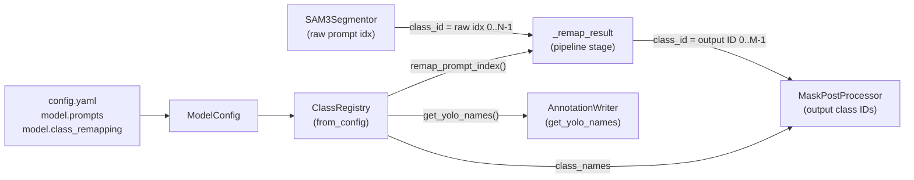

# `src/class_registry.py` — Class Registry Module

## Purpose

`ClassRegistry` is the **single source of truth** for class names, class IDs, and many-to-one prompt-to-output remapping across the pipeline.  It eliminates all hardcoded class name lists (`["teacher", "student"]`) from every module.

## Public API

```python
ClassRegistry(prompts: List[str], class_remapping: Optional[Dict[str, str]] = None)
```

| Method / Property | Signature | Description |
|---|---|---|
| `remap_prompt_index` | `(idx: int) → int` | Convert raw SAM3 prompt index → output class ID |
| `get_class_name` | `(output_id: int) → str` | Get display name for an output class ID |
| `get_yolo_names` | `() → Dict[int, str]` | Ordered dict for YOLO `data.yaml` `names` field |
| `get_output_id_for_prompt_name` | `(name: str) → int` | Lookup by prompt name string |
| `to_dict` | `() → Dict` | Serialise to plain dict for IPC (multiprocessing) |
| `from_dict` | `(d: Dict) → ClassRegistry` | Deserialise from IPC dict (classmethod) |
| `from_config` | `(model_config) → ClassRegistry` | Primary factory — reads `model_config.prompts` + `model_config.class_remapping` (classmethod) |
| `validate` | `() → None` | Raise `ValueError` on bad config |
| `class_names` | `List[str]` (property) | Ordered output class names |
| `num_classes` | `int` (property) | Number of output classes (M ≤ N) |

## Design

### Many-to-one Remapping

User config specifies only **name-to-name** mappings — no numeric IDs.  The registry auto-computes all IDs:

```
prompts:        ["teacher", "student", "kid", "child", "Adult"]
class_remapping: {"kid": "student", "child": "student", "Adult": "teacher"}

Output classes (first-seen order): ["teacher", "student"]   → IDs {0, 1}
Prompt → Output mapping:
  0 (teacher) → 0
  1 (student) → 1
  2 (kid)     → 1
  3 (child)   → 1
  4 (Adult)   → 0
```

### IPC Serialisation

`to_dict()` / `from_dict()` enable safe transfer of `ClassRegistry` across `multiprocessing` process boundaries (config is serialised to plain dicts before being passed to worker processes via `initargs`).

## Dependencies

- **Implements:** no Protocol (it is a data object consumed by pipeline stages)
- **Config slice:** `ModelConfig` (`config.model`)
- **Imports:** `src/logging_system.py` only
- **Imported by:** `pipeline.py`, `annotation_writer.py`, `parallel_processor.py`

## Data Flow



## Usage Examples

### Standalone
```python
from src.class_registry import ClassRegistry

registry = ClassRegistry(
    ["teacher", "student", "kid"],
    class_remapping={"kid": "student"}
)
# SAM3 returned prompt index 2 (kid)
output_id = registry.remap_prompt_index(2)  # → 1 (student)
print(registry.get_class_name(output_id))    # → "student"
print(registry.get_yolo_names())             # → {0: "teacher", 1: "student"}
```

### IPC
```python
# In main process:
d = registry.to_dict()
# In worker process:
registry = ClassRegistry.from_dict(d)
```

### From Config
```python
from src.class_registry import ClassRegistry
from src.config_manager import load_config

config = load_config("config/config.yaml")
registry = ClassRegistry.from_config(config.model)
```

## Edge Cases

| Condition | Behaviour |
|---|---|
| Empty `prompts` | `ValueError: prompts list is empty` |
| `class_remapping` key not in prompts | `ValueError: remap key 'X' not in prompts` |
| `class_remapping` target not in prompts | `ValueError: remap target 'X' not in prompts` |
| `remap_prompt_index` out of range | `ValueError: prompt index N out of range` |
| `class_remapping=None` | Treated as identity mapping (each prompt → own output class) |

## Wiring

- **Created by:** `ClassRegistry.from_config(config.model)` in `src/pipeline.py.__init__`
- **Config section:** `config.model.prompts`, `config.model.class_remapping`
- **Pipeline stage:** Called by `SegmentationPipeline._remap_result()` between segment and NMS stages
- **IPC:** Serialised via `to_dict()` / reconstructed via `from_dict()` in worker processes
