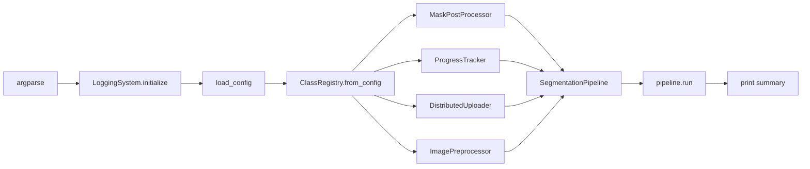

# `src/cli/pipeline.py` — `sam3-pipeline` Entry Point

## Purpose

Primary entry point for end-to-end batch processing. Wires **all** concrete
classes (ClassRegistry, MaskPostProcessor, ProgressTracker, DistributedUploader,
ImagePreprocessor) and delegates to `SegmentationPipeline.run()`.

## Public API

```
sam3-pipeline --job-name NAME [--config PATH] [--resume] [--input-dir DIR]
              [--output-dir DIR] [--device DEVICE] [--workers N] [--log-level LEVEL]
```

## Design

- Initialises `LoggingSystem` **first** before any other action.
- Constructs every dependency from config and injects via `SegmentationPipeline.__init__`.
- Applies `validate_config()` warnings to logger + console.
- Always calls `pipeline.cleanup()` in `finally` block — even on error or interrupt.

## Dependencies

- **Wires**: `ClassRegistry`, `MaskPostProcessor`, `ProgressTracker`,
  `DistributedUploader`, `ImagePreprocessor`, `SegmentationPipeline`
- **Config slices consumed**: Full `Config` (all stages need different slices)
- **Protocols used**: `PostProcessor`, `Tracker`, `Uploader`

## Data Flow



## Usage Examples

```bash
sam3-pipeline --job-name batch_001 --config config/config.yaml
sam3-pipeline --job-name batch_001 --resume
sam3-pipeline --job-name test --device cpu --workers 1 --log-level DEBUG
```

## Edge Cases

- `KeyboardInterrupt` → prints "use --resume" message, returns exit code 1
- `Exception` from `pipeline.run()` → logs error, returns exit code 1
- `cleanup()` always called regardless of error path
- Config load failure → returns 1 immediately (no pipeline created)

## Wiring

| Item | Value |
|------|-------|
| Console script | `sam3-pipeline = src.cli.pipeline:main` |
| Config consumed | Full `Config` |
| Key factory calls | `ClassRegistry.from_config()`, `auto_select_strategy()` (inside `create_processor`) |

## Phase 4 — Created by Agent B (23-02-2026)
