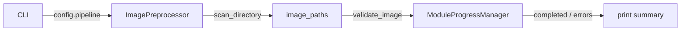

# `src/cli/preprocess.py` — `sam3-preprocess` Entry Point

## Purpose

Validates and scans input images. Wraps `ImagePreprocessor.validate_image()`
and `scan_directory()` with a Rich progress bar.

## Public API

```
sam3-preprocess [--config PATH] [--input-dir DIR] [--output-dir DIR]
                [--fast] [--log-level LEVEL]
```

`--fast` enables `ImagePreprocessor.set_fast_scan(True)` (skips `cv2.imread`).

## Dependencies

- **Wires**: `ImagePreprocessor` (only `config.pipeline` slice)
- **Config slice**: `config.pipeline` (resolution, supported_formats, num_workers)

## Data Flow



## Wiring

| Console script | `sam3-preprocess = src.cli.preprocess:main` |
|---|---|
| Config slice | `config.pipeline` |
| Exit codes | 0 = no errors, 1 = errors found or config failed |

## Phase 4 — Created by Agent B (23-02-2026)
