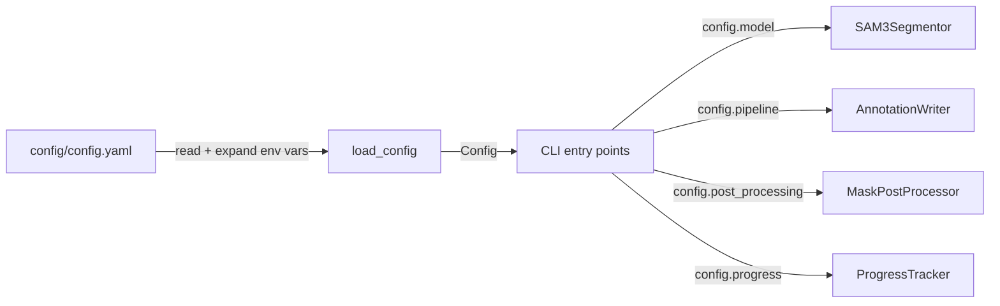

# config_manager

## Purpose

Loads, validates, and exposes the nested configuration hierarchy for the SAM 3
segmentation pipeline.  All config is sourced from `config/config.yaml`.
Environment variables in the form `${VAR_NAME}` are expanded automatically.

## Public API

### Dataclasses

| Class | Fields | Description |
|-------|--------|-------------|
| `PipelineConfig` | `input_dir`, `output_dir`, `resolution`, `supported_formats`, `num_workers`, `input_mode`, `train/valid/test_percent`, `neither_dir` | Main pipeline paths and split ratios |
| `ModelConfig` | `path`, `confidence`, `prompts`, `half_precision`, `device`, `parallel_workers`, `class_remapping` | SAM3 inference settings |
| `SplitConfig` | `train_ratio`, `valid_ratio`, `test_ratio`, `random_seed` | Dataset split ratios |
| `ProgressConfig` | `db_path`, `checkpoint_interval`, `resume` | Persistence settings |
| `RoboflowConfig` | `api_key`, `workspace`, `project`, `version`, `upload_workers`, `batch_size` | Upload config |
| `PostProcessingConfig` | `enabled`, `strategy`, `iou_threshold`, `confidence_threshold`, `enable_class_specific`, soft-NMS params | NMS settings |
| `GPUConfig` | `strategy`, `devices`, `workers_per_gpu`, `memory_threshold` | GPU orchestration |
| `LoggingConfig` | `level`, `log_file`, `json_output`, `max_file_size_mb`, `console_rich` | Logging config |
| `Config` | Aggregates all the above as fields | Root config container |

### Functions

| Function | Signature | Description |
|----------|-----------|-------------|
| `load_config` | `(config_path: Path) → Config` | Load + validate full config from YAML |
| `load_config_from_dict` | `(data: Dict) → Config` | Reconstruct config from serialised dict (IPC use) |

## Design

- **ISP compliant**: Pipeline components receive only their specific config slice
  (e.g., `SAM3Segmentor(config.model)`, not `SAM3Segmentor(config)`).
- **Validated at construction**: `__post_init__` methods enforce valid ranges and
  convert raw strings to `Path` objects.
- **No IDs in config**: Class remapping uses name-to-name only; numeric IDs are
  computed by `ClassRegistry`.

## Dependencies

- Imports: `yaml`, `os`, `dataclasses`, `pathlib`, `src.logging_system`
- Does NOT import any other `src/` modules

## Data Flow



## Usage Examples

```python
from src.config_manager import load_config
from pathlib import Path

config = load_config(Path("config/config.yaml"))
print(config.model.prompts)            # ["teacher", "student"]
print(config.post_processing.strategy) # "confidence"

# IPC serialisation for multiprocessing
from src.config_manager import load_config_from_dict
config_dict = {... }  # serialised dict passed via multiprocessing initargs
config = load_config_from_dict(config_dict)
```

## Edge Cases

- Missing YAML keys raise `KeyError` on access or `ValueError` at `__post_init__`
- `${VAR_NAME}` that does not exist in environment expands to empty string
- `input_mode` must be `"pre-split"` or `"flat"` — any other value raises `ValueError`

## Wiring

- Used by: all CLI entry points in `src/cli/`
- Required for: IPC workers via `load_config_from_dict(config.pipeline.to_dict())`

## Phase 7 — Audit Compliance

**Date:** 25-02-2026

### Changes

- Renamed `logger` → `_logger` (dead code — never used, but consistent naming)
- Fixed 2 exception chaining issues: `except TypeError as e: raise ValueError(...) from e`
