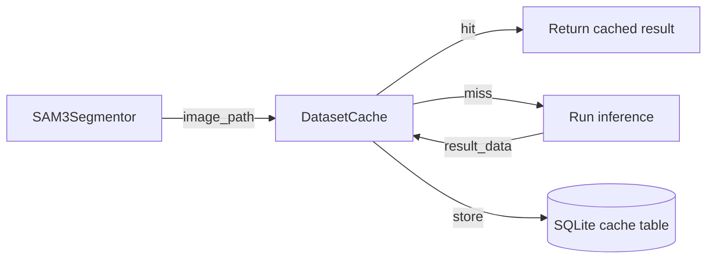

# dataset_cache

## Purpose

Provides a fast lookup cache for already-processed images, preventing redundant
segmentation work on pipeline restarts.  Backed by the same SQLite database as
`ProgressTracker`.

## Public API

| Method | Signature | Description |
|--------|-----------|-------------|
| `__init__` | `(db_path: Path)` | Open (or create) the SQLite cache |
| `is_cached` | `(image_path: Path) → bool` | Return True if image has a valid cached result |
| `cache_result` | `(image_path: Path, result_data: Dict) → None` | Store a serialised result for an image |
| `get_cached_result` | `(image_path: Path) → Optional[Dict]` | Retrieve previously cached result dict |
| `invalidate` | `(image_path: Path) → None` | Delete cache entry for one image |
| `clear_all` | `() → None` | Drop all cache entries |
| `close` | `() → None` | Close the DB connection |

## Design

- **Lazy loading** (`_ensure_loaded()`): DB connection is created on first use.
- **WAL mode**: Uses SQLite WAL + `synchronous=NORMAL` for safe concurrent access.
- Cache key is the absolute image path string; values are JSON-serialised dicts.
- Shares the same DB file as `ProgressTracker` via a separate `dataset_cache`
  table (no schema conflict).

## Dependencies

- Imports: `sqlite3`, `json`, `pathlib`, `src.logging_system`
- Does NOT implement any Protocol from `src/interfaces.py`

## Data Flow



## Usage Examples

```python
from src.dataset_cache import DatasetCache
from pathlib import Path

cache = DatasetCache(db_path=Path("logs/pipeline.db"))
img = Path("data/train/images/room01.jpg")

if cache.is_cached(img):
    result = cache.get_cached_result(img)
else:
    result = segmentor.process_image(img)
    cache.cache_result(img, result.to_dict())

cache.close()
```

## Edge Cases

- `get_cached_result` returns `None` if the image is not cached
- JSON deserialisation failures are caught; returns `None` and logs a warning
- Thread-safe under the WAL mode for single-writer / multiple-reader patterns

## Wiring

- Created by: `src/cli/segment.py` (if caching is enabled in config)
- Config source: `config.progress.db_path`
- Pipeline stage: optional caching layer before `[Segment]`
