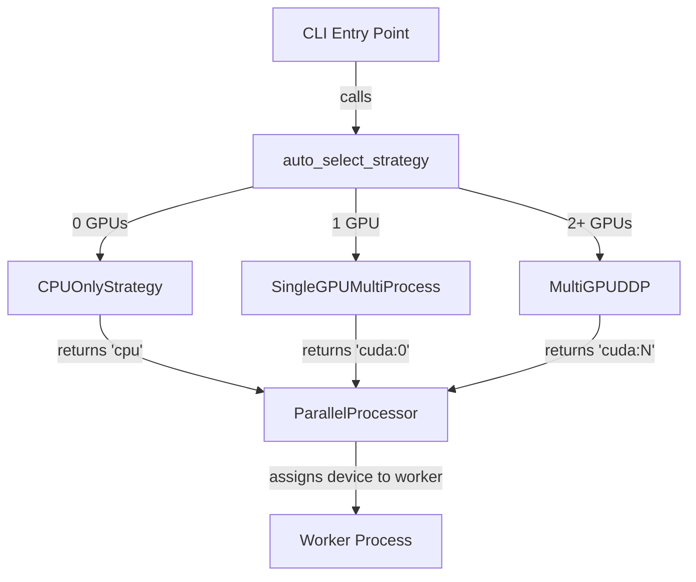

# `src/gpu_strategy.py` — GPU Strategy Module

## Purpose

Provides an OCP-compliant `GPUStrategy` ABC with three concrete implementations
and an `auto_select_strategy()` factory that picks the right strategy based on
available hardware at runtime.

Also owns `DeviceManager` (migrated from `sam3_segmentor.py` in Phase 3).

---

## Public API

### `DeviceManager`

Static helper class for device detection and memory reporting.

| Method | Signature | Description |
|--------|-----------|-------------|
| `get_available_devices` | `() -> Dict[str, Any]` | Detect CUDA devices; returns keys `cuda_available`, `cuda_device_count`, `cuda_devices`, `recommended_device` |
| `resolve_device` | `(device_config: str) -> str` | Resolve `"auto"` → best device; fall back to `"cpu"` if CUDA unavailable |
| `get_memory_info` | `() -> Dict[str, float]` | CPU RAM + per-GPU allocated/reserved/free GB |
| `maybe_gc` | `(process_count, gc_interval, is_cpu) -> None` | Trigger `gc.collect()` + optional `torch.cuda.empty_cache()` periodically |

### `GPUStrategy` (ABC)

Abstract base class. Concrete subclasses must implement:

| Method / Property | Description |
|-------------------|-------------|
| `initialize()` | Set up the process group / env vars |
| `get_device_for_worker(worker_id: int) -> str` | Return device string for a given worker |
| `cleanup()` | Tear down and release resources |
| `num_workers: int` | Number of parallel workers this strategy manages |
| `backend: str` | Descriptor string (e.g. `"cpu"`, `"single_gpu"`, `"ddp_nccl"`) |

### `CPUOnlyStrategy`

All workers receive `"cpu"`. Uses Python `ProcessPoolExecutor` for compute.

```python
s = CPUOnlyStrategy(workers=4)
s.initialize()
device = s.get_device_for_worker(worker_id=0)  # → "cpu"
```

### `SingleGPUMultiProcess`

All workers share one GPU. `workers_per_gpu` controls pool size.

```python
s = SingleGPUMultiProcess(device="cuda:0", workers_per_gpu=2)
s.initialize()
device = s.get_device_for_worker(worker_id=1)  # → "cuda:0"
```

### `MultiGPUDDP`

One rank per GPU. Uses `torch.distributed` + NCCL backend.

```python
s = MultiGPUDDP(devices=["cuda:0", "cuda:1"])
s.initialize()  # calls dist.init_process_group("nccl")
device = s.get_device_for_worker(worker_id=0)  # → "cuda:0"
device = s.get_device_for_worker(worker_id=1)  # → "cuda:1"
```

### `auto_select_strategy(config) -> GPUStrategy`

Factory function. Respects explicit `config.gpu.strategy` or auto-detects.

---

## Design

Follows the **Strategy Pattern** (OCP). Adding a new strategy requires only:

1. Subclass `GPUStrategy`
2. Implement the four abstract members
3. Register in `auto_select_strategy` if auto-selection is desired

No modification to existing strategies or the factory needed (Open for extension,
Closed for modification per OCP).

---

## Dependencies

- **Implements**: N/A (not a Protocol; is a Strategy ABC)
- **Consumes**: `config.gpu` (GPUConfig dataclass)
- **Imports**: `src.logging_system`, `gc`, `os`, `abc`, `typing`; optional `torch`, `psutil`
- **Migrated from**: `DeviceManager` was previously in `src/sam3_segmentor.py`

---

## Data Flow



---

## Usage Examples

```python
from src.gpu_strategy import auto_select_strategy

# Auto-detect
strategy = auto_select_strategy(config)
strategy.initialize()
device = strategy.get_device_for_worker(worker_id=0)
print(device)  # "cpu", "cuda:0", etc.

# Explicit CPU
from src.gpu_strategy import CPUOnlyStrategy
strategy = CPUOnlyStrategy(workers=4)

# DeviceManager
from src.gpu_strategy import DeviceManager
info = DeviceManager.get_available_devices()
device = DeviceManager.resolve_device("auto")
```

---

## Edge Cases

- If `torch` is not installed, `DeviceManager` gracefully returns `"cpu"` for all queries
- If `psutil` is not installed, `get_memory_info()` returns `{cpu_ram_gb: 0.0}`
- `MultiGPUDDP.initialize()` raises `RuntimeError` if `torch.distributed` is unavailable
- `MultiGPUDDP.get_device_for_worker()` raises `ValueError` for out-of-range `worker_id`
- `auto_select_strategy()` raises `ValueError` for unknown strategy names

---

## Wiring

- **CLI**: `src/cli/segment.py` calls `auto_select_strategy(config)` and passes result to `ParallelProcessor`
- **Config read**: `config.gpu` (Strategy, devices, workers_per_gpu, memory_threshold)
- **Pipeline stage**: Consumed by `ParallelProcessor` constructor — not a pipeline stage itself
- **sam3_segmentor.py** re-exports `DeviceManager` as `from .gpu_strategy import DeviceManager`

---

## Phase 3 — Created by Agent B

**Date:** 23-02-2026  
**Status:** Delivered ✅

### Test Results

```
pytest tests/test_gpu_strategy.py -v
========================= 47 passed in 1.86s =========================
```
