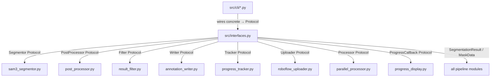

# `src/interfaces.py`

## Purpose

Single source of all Protocol (interface) definitions for the SAM 3 pipeline. Every core module depends on these abstractions, never on concrete sibling classes. This enforces the Dependency Inversion Principle (DIP) and makes every component independently testable via mocks.

## Public API

### Data Structures

| Symbol | Kind | Description |
|--------|------|-------------|
| `MaskData` | `@dataclass` | One segmented mask: pixel mask, confidence, class ID, area, bbox, polygon |
| `SegmentationResult` | `@dataclass` | All masks for one image + metadata |
| `ProcessingStats` | `@dataclass` | Generic counters: processed, skipped, errors, time |

### Protocols

| Protocol | Implemented by | Key methods |
|----------|---------------|-------------|
| `ProgressCallback` | `ModuleProgressManager`, `ProgressTracker` | `on_item_start`, `on_item_complete`, `on_item_error` |
| `Segmentor` | `SAM3Segmentor` | `process_image → Optional[SegmentationResult]`, `process_batch → List[Optional[SegmentationResult]]`, `get_device_info`, `cleanup` |
| `PostProcessor` | `MaskPostProcessor` | `apply_nms`, `get_stats → Dict[str, Any]`, `reset_stats` |
| `Filter` | `ResultFilter` | `filter_result(image_path, result, copy_to_neither) → bool`, `get_stats → Dict[str, Any]`, `reset_stats` |
| `Writer` | `AnnotationWriter` | `write_annotation(image_path, result, split, copy_image) → Optional[Path]`, `write_data_yaml`, `get_stats → Dict[str, Any]`, `reset_stats` |
| `Tracker` | `ProgressTracker` | `create_job(name, image_paths, splits) → int`, `mark_completed(image_id)`, `mark_error(image_id, error_msg)`, `get_progress(job_id)`, `checkpoint(job_id)` |
| `Uploader` | `DistributedUploader` | `queue_batch(batch_dir, batch_id, split)`, `wait_for_uploads(timeout) → bool`, `shutdown` |
| `Processor` | `ParallelProcessor` | `start`, `process_batch`, `shutdown` |

All Protocols carry `@runtime_checkable` — `isinstance(obj, Segmentor)` works.

### Phase 7 Protocol Signature Reconciliation

All Protocol signatures were reconciled to match their proven implementations:

- **Segmentor**: Removed `callback` kwarg from `process_image` and `process_batch`. Return types changed to `Optional[SegmentationResult]` and `List[Optional[SegmentationResult]]` respectively.
- **Filter**: `filter_result` now takes `(image_path: Path, result: Optional[Any], copy_to_neither: bool = True) → bool` (was `(result, *, callback) → SegmentationResult`).
- **Writer**: `write_annotation` now takes `(image_path: Path, result: Any, split: str, copy_image: bool = True) → Optional[Path]` (was `(result, *, split, callback) → Path`). `get_stats` returns `Dict[str, Any]`.
- **Tracker**: `create_job(name, image_paths, splits) → int` (was `(job_name, total_images) → None`). `mark_completed` / `mark_error` accept `image_id: int`.
- **Uploader**: `queue_batch(batch_dir, batch_id, split)` signature. `wait_for_uploads(timeout) → bool` (was `() → ProcessingStats`).
- **PostProcessor**: `get_stats` returns `Dict[str, Any]` (was `ProcessingStats`).

## Design

- **Protocols over ABCs**: Python `typing_extensions.Protocol` used so concrete classes do NOT need to inherit from the Protocol — structural subtyping (duck typing) applies.
- **`@runtime_checkable`**: Allows `isinstance` checks in factory functions and tests.
- **Data classes are plain**: `MaskData` and `SegmentationResult` use `@dataclass` with no inheritance — they are pure value objects.
- **`mask: Any`** in `MaskData`: The numpy array type is declared `Any` to keep this module free of a numpy import (leaf module constraint).

## Dependencies

- Imports: `typing`, `typing_extensions`, `dataclasses`, `pathlib` — zero internal `src/` imports
- Layer: INFRASTRUCTURE — imported by many, imports nothing from `src/`

## Data Flow



## Usage Examples

```python
# Implementing a Protocol — no inheritance needed:
from src.interfaces import Segmentor, SegmentationResult, ProgressCallback
from pathlib import Path
from typing import List, Optional, Dict, Any

class SAM3Segmentor:
    def process_image(self, image_path: Path) -> Optional[SegmentationResult]:
        ...
    def process_batch(self, image_paths: List[Path]) -> List[Optional[SegmentationResult]]:
        ...
    def get_device_info(self) -> Dict[str, Any]:
        ...
    def cleanup(self) -> None:
        ...

# Verify Protocol compliance:
assert isinstance(SAM3Segmentor(), Segmentor)  # True (runtime_checkable)


# Type-safe pipeline constructor (in pipeline.py):
from src.interfaces import Segmentor, PostProcessor, Writer, Filter, Tracker

class SegmentationPipeline:
    def __init__(
        self,
        config,
        *,
        registry: Optional[object] = None,
        preprocessor: Optional[object] = None,
        tracker: Optional[object] = None,
        uploader: Optional[object] = None,
        post_processor: Optional[object] = None,
    ) -> None:
        ...
```

## Edge Cases

- `ProgressCallback` methods are no-ops in the Protocol body (`...`). When no callback is passed, modules must guard: `if callback: callback.on_item_complete(id)`.
- `MaskData.polygon` is `Optional[List[float]]` — it is `None` until `AnnotationWriter` converts the mask. NMS and filter stages must tolerate `polygon=None`.
- `ProcessingStats.extra` is an open dict for module-specific counters (e.g. masks merged, IoU values).

## Wiring

- **Created by**: No factory — this is a pure definitions module.
- **Imported by**: Every module that participates in the pipeline.
- **Config reads**: None — infrastructure only.
- **Pipeline stage**: Not a stage — definitions used by all stages.

## Phase 7 — Audit Compliance

**Date:** 25-02-2026

### Changes

All 6 Protocol definitions reconciled to match their proven implementations (13 signature mismatches fixed):

- **Segmentor**: Removed `callback` kwarg from `process_image`/`process_batch`. Return types changed to `Optional[SegmentationResult]` / `List[Optional[SegmentationResult]]`.
- **Filter**: `filter_result` → `(image_path, result, copy_to_neither) → bool`. `get_stats` → `Dict[str, Any]`.
- **Writer**: `write_annotation` → `(image_path, result, split, copy_image) → Optional[Path]`. `get_stats` → `Dict[str, Any]`.
- **Tracker**: `create_job(name, image_paths, splits) → int`. `mark_completed/mark_error` accept `image_id: int`.
- **Uploader**: `queue_batch(batch_dir, batch_id, split)`. `wait_for_uploads(timeout) → bool`.
- **PostProcessor**: `get_stats` → `Dict[str, Any]`.
- `ProcessingStats` retained as public data structure (used in tests).
