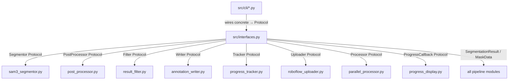

# `src/interfaces.py`

## Purpose

Single source of all Protocol (interface) definitions for the SAM 3 pipeline. Every core module depends on these abstractions, never on concrete sibling classes. This enforces the Dependency Inversion Principle (DIP) and makes every component independently testable via mocks.

## Public API

### Data Structures

| Symbol | Kind | Description |
|--------|------|-------------|
| `MaskData` | `@dataclass` | One segmented mask: pixel mask, confidence, class ID, area, bbox, polygon |
| `SegmentationResult` | `@dataclass` | All masks for one image + metadata |
| `ProcessingStats` | `@dataclass` | Generic counters: processed, skipped, errors, time |

### Protocols

| Protocol | Implemented by | Key methods |
|----------|---------------|-------------|
| `ProgressCallback` | `ModuleProgressManager`, `ProgressTracker` | `on_item_start`, `on_item_complete`, `on_item_error` |
| `Segmentor` | `SAM3Segmentor` | `process_image`, `process_batch`, `get_device_info`, `cleanup` |
| `PostProcessor` | `MaskPostProcessor` | `apply_nms`, `get_stats`, `reset_stats` |
| `Filter` | `ResultFilter` | `filter_result`, `get_stats`, `reset_stats` |
| `Writer` | `AnnotationWriter` | `write_annotation`, `write_data_yaml`, `get_stats`, `reset_stats` |
| `Tracker` | `ProgressTracker` | `create_job`, `mark_completed`, `mark_error`, `get_progress`, `checkpoint` |
| `Uploader` | `DistributedUploader` | `queue_batch`, `wait_for_uploads`, `shutdown` |
| `Processor` | `ParallelProcessor` | `start`, `process_batch`, `shutdown` |

All Protocols carry `@runtime_checkable` — `isinstance(obj, Segmentor)` works.

## Design

- **Protocols over ABCs**: Python `typing_extensions.Protocol` used so concrete classes do NOT need to inherit from the Protocol — structural subtyping (duck typing) applies.
- **`@runtime_checkable`**: Allows `isinstance` checks in factory functions and tests.
- **Data classes are plain**: `MaskData` and `SegmentationResult` use `@dataclass` with no inheritance — they are pure value objects.
- **`mask: Any`** in `MaskData`: The numpy array type is declared `Any` to keep this module free of a numpy import (leaf module constraint).

## Dependencies

- Imports: `typing`, `typing_extensions`, `dataclasses`, `pathlib` — zero internal `src/` imports
- Layer: INFRASTRUCTURE — imported by many, imports nothing from `src/`

## Data Flow



## Usage Examples

```python
# Implementing a Protocol — no inheritance needed:
from src.interfaces import Segmentor, SegmentationResult, ProgressCallback
from pathlib import Path
from typing import Iterator, List, Optional, Dict, Any

class SAM3Segmentor:
    def process_image(self, image_path: Path, *, callback=None) -> SegmentationResult:
        ...
    def process_batch(self, image_paths, *, callback=None) -> Iterator[SegmentationResult]:
        ...
    def get_device_info(self) -> Dict[str, Any]:
        ...
    def cleanup(self) -> None:
        ...

# Verify Protocol compliance:
assert isinstance(SAM3Segmentor(), Segmentor)  # True (runtime_checkable)


# Type-safe pipeline constructor (in pipeline.py):
from src.interfaces import Segmentor, PostProcessor, Writer, Filter, Tracker

class SegmentationPipeline:
    def __init__(
        self,
        segmentor: Segmentor,
        post_processor: PostProcessor,
        writer: Writer,
        filter_: Filter,
        tracker: Tracker,
    ) -> None:
        ...
```

## Edge Cases

- `ProgressCallback` methods are no-ops in the Protocol body (`...`). When no callback is passed, modules must guard: `if callback: callback.on_item_complete(id)`.
- `MaskData.polygon` is `Optional[List[float]]` — it is `None` until `AnnotationWriter` converts the mask. NMS and filter stages must tolerate `polygon=None`.
- `ProcessingStats.extra` is an open dict for module-specific counters (e.g. masks merged, IoU values).

## Wiring

- **Created by**: No factory — this is a pure definitions module.
- **Imported by**: Every module that participates in the pipeline.
- **Config reads**: None — infrastructure only.
- **Pipeline stage**: Not a stage — definitions used by all stages.
