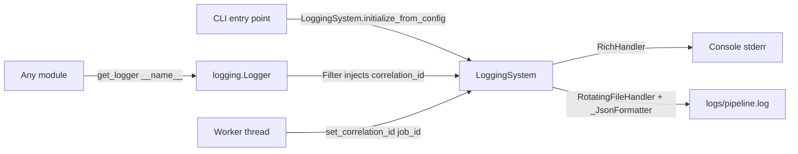

# `src/logging_system.py`

## Purpose

Central logging singleton for the SAM 3 Segmentation Pipeline. Every module calls `LoggingSystem.get_logger(__name__)` rather than configuring logging independently. This ensures a single, consistent log format — structured JSON to file, Rich-formatted output to console — across the entire codebase.

## Public API

| Symbol | Kind | Description |
|--------|------|-------------|
| `LoggingSystem` | class (singleton) | Main logging facade |
| `LoggingSystem.initialize(...)` | classmethod | Configure handlers (call once per process) |
| `LoggingSystem.initialize_from_config(config)` | classmethod | Configure from `LoggingConfig` dataclass or dict |
| `LoggingSystem.get_logger(name)` | classmethod | Return a named `logging.Logger` |
| `LoggingSystem.set_correlation_id(id)` | classmethod | Bind job ID to current thread |
| `LoggingSystem.get_correlation_id()` | classmethod | Read current thread's job ID |
| `LoggingSystem.reset()` | classmethod | Tear down & reset (tests only) |
| `trace` | decorator | Log entry / exit / duration on any callable |
| `_CorrelationFilter` | internal | Injects `correlation_id` into every log record |
| `_JsonFormatter` | internal | One JSON object per line for structured analysis |

### `LoggingSystem.initialize` signature
```python
LoggingSystem.initialize(
    *,
    level: str = "INFO",
    log_file: Optional[str] = None,
    json_output: bool = True,
    max_file_size_mb: int = 50,
    console_rich: bool = True,
) -> None
```

### `@trace` decorator
```python
@trace
def process_image(self, path: Path) -> SegmentationResult:
    ...
# Logs: "→ MyClass.process_image enter"
# Logs: "← MyClass.process_image exit (12.3 ms)"
# On error: "✗ MyClass.process_image raised ValueError after 0.4 ms: ..."
```

## Design

- **Singleton** via `__new__` + `threading.Lock` — safe for multi-threaded pipeline.
- **Thread-local correlation IDs** via `threading.local` inside `_CorrelationFilter` — each worker thread can carry its own job ID without interfering with others.
- **Two handlers**: `RichHandler` (console, ephemeral) + `RotatingFileHandler` (JSON, durable). Both receive the `_CorrelationFilter`.
- **`@trace` uses `func.__module__`** so log records come from the originating module name, not `logging_system`.
- **`sys.excepthook`** captures any unhandled exception to the log file before the process exits.

## Dependencies

- Implements: no Protocol (infrastructure module)
- Consumes config: `LoggingConfig` (or compatible dict) with keys `level`, `log_file`, `json_output`, `max_file_size_mb`, `console_rich`
- Imports: `rich.console`, `rich.logging`, stdlib `logging`, `threading`, `json`, `pathlib`

## Data Flow



## Usage Examples

```python
# In a CLI entry point (first thing):
from src.logging_system import LoggingSystem
LoggingSystem.initialize(level="INFO", log_file="logs/pipeline.log")
LoggingSystem.set_correlation_id("job_batch_001")

# In any module:
from src.logging_system import LoggingSystem, trace
logger = LoggingSystem.get_logger(__name__)

class MyProcessor:
    @trace
    def run(self, path: Path) -> None:
        logger.info("Processing %s", path.name)
```

## Edge Cases

- Calling `initialize()` a second time is a no-op (idempotent). Use `reset()` in tests between calls.
- `log_file=None` disables file logging — only console output is produced.
- Workers spawned via `multiprocessing` do NOT inherit the singleton state. Each worker must call `LoggingSystem.initialize(...)` after spawning.
- `@trace` logs at DEBUG level so it is silent in production INFO logs.

## Wiring

- **Created by**: Every CLI entry point in `src/cli/` — each calls `LoggingSystem.initialize_from_config(config.logging)` as its first line.
- **Config reads**: `config.logging` → `LoggingConfig` dataclass (defined in `src/config_manager.py`).
- **Pipeline stage**: Not a stage — infrastructure. Initialized before the pipeline object is constructed.
