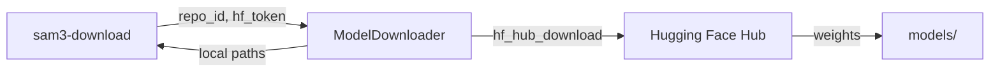

# model_downloader

## Purpose

Downloads the SAM 3 model weights from Hugging Face Hub and stores them in the
local `models/` directory.  Supports both full download and resumable partial
downloads.

## Public API

### `ModelDownloader`

| Method | Signature | Description |
|--------|-----------|-------------|
| `__init__` | `(model_dir: Path, hf_token: Optional[str] = None)` | Initialise with target directory and optional HF auth token |
| `download` | `(repo_id: str, filename: str) → Path` | Download a single file from HF Hub; returns local path |
| `download_all` | `(repo_id: str) → List[Path]` | Download all required model artefacts |
| `is_downloaded` | `() → bool` | Return True if all required files are present |
| `get_model_path` | `() → Path` | Return path to the main `.pt` checkpoint |

## Design

- Uses `huggingface_hub` library (`hf_hub_download`) internally.
- Checks for existing files before downloading to support resumable workflows.
- `hf_token` is read from environment variable `HF_TOKEN` if not passed directly.
- Required artefacts: `sam3.pt`, `config.json`, `tokenizer.json`, `merges.txt`,
  `vocab.json`, `processor_config.json`, `tokenizer_config.json`, `special_tokens_map.json`, `model.safetensors`.

## Dependencies

- Imports: `huggingface_hub`, `pathlib`, `src.logging_system`

## Data Flow



## Usage Examples

```python
from src.model_downloader import ModelDownloader
from pathlib import Path

downloader = ModelDownloader(
    model_dir=Path("models/"),
    hf_token="hf_...",
)

if not downloader.is_downloaded():
    downloader.download_all(repo_id="AhmedHany/SAM3")

model_path = downloader.get_model_path()
```

## Edge Cases

- If `hf_token` is `None` and the repo requires authentication, raises `ValueError`
- Re-running download when files already exist is a no-op (skipped)
- Network errors raise `huggingface_hub.utils.RepositoryNotFoundError` or
  `requests.exceptions.ConnectionError`

## Wiring

- Called by: `src/cli/download.py` (`sam3-download` entry point)
- Also used by: `scripts/download_model.py` (thin wrapper)
- Config: `--token` CLI flag or `HF_TOKEN` env var

## Phase 7 — Audit Compliance

**Date:** 25-02-2026

### Changes

- Replaced `import logging` with `LoggingSystem, trace` from `src.logging_system`
- Renamed `logger` → `_logger` (private convention)
- Added `@trace` decorator to: `check_auth`, `download_file`, `download_model`, `verify_model`
- Fixed exception chaining: `except ImportError as exc: raise ImportError(...) from exc`
