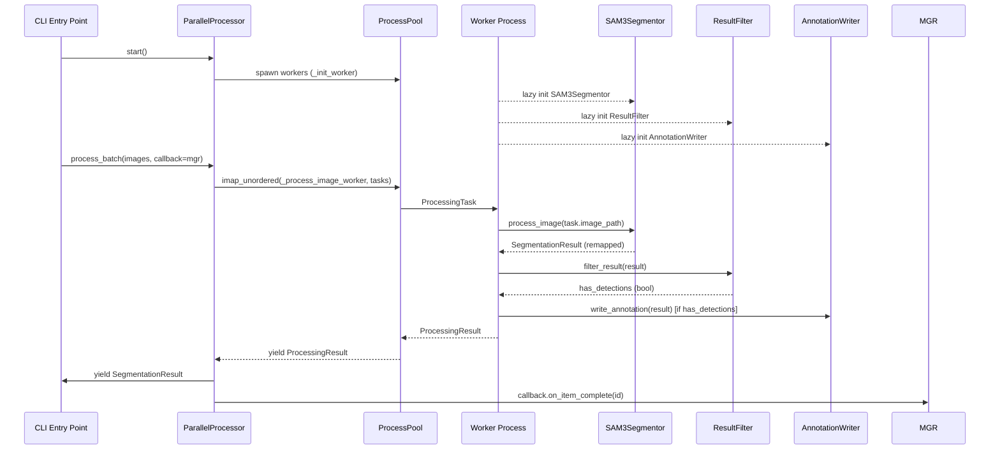

# `src/parallel_processor.py` — Parallel Processor Module

## Purpose

Orchestrates multi-process (or sequential) inference over a batch of images.
Implements the `Processor` Protocol from `src/interfaces.py` and accepts all
dependencies via constructor injection (DIP).

---

## Public API

### Transfer Objects (IPC-safe dataclasses)

#### `ProcessingTask`

```python
@dataclass
class ProcessingTask:
    image_id: str
    image_path: Path
    split: str
```

Picklable task handed to each worker subprocess.

#### `ProcessingResult`

```python
@dataclass
class ProcessingResult:
    image_id: str
    image_path: Path
    split: str
    success: bool
    has_detections: bool
    error_message: Optional[str]
    result_data: Optional[Dict]
```

Picklable result returned from each worker subprocess.

---

### `ParallelProcessor`

Multi-process processor. Implements `Processor` Protocol.

```python
proc = ParallelProcessor(
    config: Config,
    gpu_strategy: GPUStrategy,
    registry: ClassRegistry,
    num_workers: Optional[int] = None,
)
```

| Method | Signature | Description |
|--------|-----------|-------------|
| `start` | `() -> None` | Initialize strategy, build device list, create `ProcessPoolExecutor` |
| `process_batch` | `(image_paths: List[Path], *, callback: Optional[ProgressCallback]) -> Iterator[SegmentationResult]` | Submit tasks, yield results as they complete |
| `shutdown` | `(wait: bool = True) -> None` | Drain pool, call `gpu_strategy.cleanup()` |

---

### `SequentialProcessor`

Single-process processor. Implements `Processor` Protocol. Lazily loads
`SAM3Segmentor`, `ResultFilter`, `AnnotationWriter` on first use.

```python
proc = SequentialProcessor(config: Config, registry: ClassRegistry)
```

Same `start()`, `process_batch()`, `shutdown()` API as `ParallelProcessor`.

---

### `create_processor(config, registry) -> Processor`

Factory. Returns `SequentialProcessor` when `config.gpu.workers_per_gpu == 1`,
otherwise calls `auto_select_strategy(config)` and returns `ParallelProcessor`.

---

## Design

### Dependency Injection

`ParallelProcessor` accepts `GPUStrategy` via constructor (DIP). This allows
unit testing with `CPUOnlyStrategy` without touching real GPU state.

### No Global Mutable State

All worker state is held in `_worker_state`, a module-level var in each
subprocess's own memory space. Subprocesses are spawned (not forked), so
there is no accidental state sharing.

### IPC Serialization

Both `Config` and `ClassRegistry` are converted to plain dicts for `initargs`:

- `config → config.to_dict()` (all dataclass fields)
- `registry → registry.to_dict()`

Reconstructed in each worker via `load_config_from_dict()` + `ClassRegistry.from_dict()`.

### Pipeline Stage Order (Remap-before-NMS)

Inside `_process_image_worker`, the order is:

```
SAM3Segmentor.process_image()  → raw SegmentationResult
ResultFilter.filter_result()   → has_detections (bool)
AnnotationWriter.write_annotation()  (only if has_detections)
```

Remap is applied inside `SAM3Segmentor.process_image()` immediately after
inference — before the result leaves the segmentor.

---

## Dependencies

- **Implements**: `Processor` Protocol from `src/interfaces.py`
- **Consumes**: Full `Config` (all slices), `GPUStrategy`, `ClassRegistry`
- **Imports (lazy in workers)**: `SAM3Segmentor`, `ResultFilter`, `AnnotationWriter`
- **Imports (module level)**: `logging_system`, `interfaces`, `gpu_strategy`, `class_registry`, `config_manager`

---

## Data Flow



---

## Usage Examples

```python
from src.parallel_processor import create_processor
from src.class_registry import ClassRegistry

registry = ClassRegistry.from_config(config)
processor = create_processor(config, registry)
processor.start()

for result in processor.process_batch(image_paths, callback=progress_mgr):
    # result is a SegmentationResult
    print(result.image_path)

processor.shutdown(wait=True)
```

---

## Edge Cases

- `ParallelProcessor` raises `TypeError` if `gpu_strategy` or `registry` is wrong type
- `SequentialProcessor` lazily imports `SAM3Segmentor` — import errors surface on first `process_batch`
- If the worker pool dies mid-batch, `process_batch` propagates the `ProcessPoolExecutor` exception
- `shutdown(wait=False)` cancels pending futures (best-effort)
- Workers that fail to initialize log the error and skip their tasks (no crash of the main process)
- `create_processor` with `workers == 1` bypasses GPU strategy entirely

---

## Wiring

- **CLI**: `src/cli/pipeline.py` calls `create_processor(config, registry)`, passes result to `SegmentationPipeline`
- **Config read**: `config.gpu` (strategy, workers_per_gpu), `config.model` (device, prompts), `config.pipeline`
- **Pipeline stage**: Called as `Processor` in `SegmentationPipeline.run()` — yields `SegmentationResult` items

---

## Phase 2 — Original Implementation

Original file had global mutable state and no `GPUStrategy` DI.

## Phase 3 — Refactored by Agent B

**Date:** 23-02-2026  
**Status:** Delivered ✅

### What Changed

- Removed all global mutable state; replaced with per-process `_worker_state` dict
- Added `GPUStrategy` injection to `ParallelProcessor.__init__`
- Added `ClassRegistry` injection (serialized via `to_dict()` for IPC)
- Fixed `SegmentationResult` field names (`image_width`, `image_height`, `inference_time_ms`)
- Fixed `has_detections` logic (removed non-existent `result.num_detections` field)
- Added `SequentialProcessor` for single-worker case
- Added `create_processor()` factory
- Added Protocol compliance verification

### Test Results

```
pytest tests/integration/test_gpu_processor.py -v
========================= 16 passed in 1.12s =========================
```
