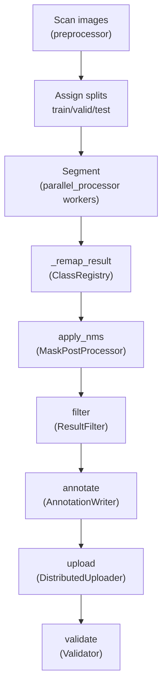

# `src/pipeline.py` — Pipeline Orchestrator Module

## Purpose

`SegmentationPipeline` coordinates all nine pipeline stages in sequence.  It accepts heavyweight dependencies via constructor injection (DI pattern), enabling test isolation and alternative implementations.

**Critical stage order:**
```
scan → split-assign → segment → REMAP → NMS → filter → annotate → upload → validate
```
The **remap** stage (`_remap_result`) converts raw SAM3 prompt indices to output class IDs and MUST run before NMS.

## Public API

### `SegmentationPipeline`

```python
SegmentationPipeline(
    config: Config,
    *,
    registry: Optional[ClassRegistry] = None,
    preprocessor: Optional[ImagePreprocessor] = None,
    tracker: Optional[ProgressTracker] = None,
    uploader: Optional[DistributedUploader] = None,
    post_processor: Optional[PostProcessor] = None,
)
```

| Method | Description |
|---|---|
| `run(job_name, resume=False) → Dict` | Execute (or resume) the full pipeline; return statistics |
| `get_status(job_name) → Optional[Dict]` | Query job progress |
| `cleanup() → None` | Release all resources |
| `_remap_result(result, registry) → SegmentationResult` | **Remap stage** — convert raw prompt indices → output class IDs (static) |
| `_assign_splits(image_paths) → List[str]` | Assign train/valid/test splits |

## Design

### Dependency Injection

All heavyweight objects are created inside `__init__` from `config` by default, but can be replaced with injected alternatives.  This enables unit testing of the orchestrator without touching the file system, the model, or a real DB.

```python
# Production (CLI)
pipeline = SegmentationPipeline(config)

# Test
pipeline = SegmentationPipeline(
    config,
    registry=mock_registry,
    tracker=mock_tracker,
    post_processor=mock_nms,
)
```

### Remap Stage (`_remap_result`)

Static method that iterates over all `MaskData` in a `SegmentationResult` and replaces each `class_id` using `ClassRegistry.remap_prompt_index()`.  Produces a new `SegmentationResult` — the original is not mutated.

```python
# Segment → Remap → NMS
raw_result   = segmentor.process_image(path)
remapped     = SegmentationPipeline._remap_result(raw_result, registry)
nms_result   = post_processor.apply_nms(remapped)
```

## Dependencies

- **Imports Protocols:** `Segmentor`, `PostProcessor`, `Writer`, `Filter`, `Tracker`, `Uploader` from `src/interfaces.py`
- **Imports concrete:** `ImagePreprocessor`, `ProgressTracker`, `DistributedUploader`, `DatasetCache`, `AnnotationWriter`, `ResultFilter`, `ClassRegistry` (wired in constructor)
- **Config:** Full `Config` object

## Data Flow



## Edge Cases

| Condition | Behaviour |
|---|---|
| Job already exists + `resume=False` | Creates a new job |
| Job not found + `resume=True` | `ValueError` |
| No images found | `ValueError` |
| Pre-split mode `pre-split` | Reads `train/valid/test/` subdirs |
| Flat mode | Scans all images → random split assignment |

## Wiring

- **Created by:** `scripts/run_pipeline.py` and `src/cli/pipeline.py` entry points
- **Config:** Full `Config` from `load_config("config/config.yaml")`
- **Remap stage:** `_remap_result()` called in `parallel_processor.py` workers after SAM3 inference
