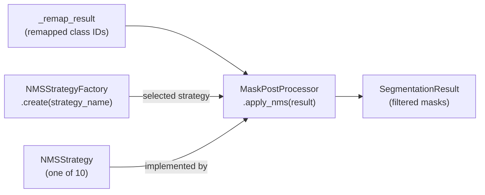

# `src/post_processor.py` — NMS Post-Processor Module

## Purpose

Implements mask-aware Non-Maximum Suppression (NMS) as a **standalone pipeline stage**, fully decoupled from the segmentor.  Uses the **Strategy Pattern** (OCP-compliant) to support 10 interchangeable suppression algorithms.

**Critical constraint:** `apply_nms()` receives masks whose `class_id` has already been remapped by `ClassRegistry`.  It never sees raw SAM3 prompt indices.

## Public API

### `NMSStrategy` (ABC)

| Method | Description |
|---|---|
| `compute_suppression_score(**kw) → float` | Compute new confidence for mask_j (`-1.0` = merge sentinel) |
| `should_suppress(new_conf, config) → bool` | Decide if mask_j should be removed |

### `NMSStrategyFactory`

| Method | Description |
|---|---|
| `register(name)` | Class decorator — self-registers a strategy |
| `create(name) → NMSStrategy` | Instantiate strategy by string or `OverlapStrategy` enum value |
| `available() → List[str]` | List all registered strategy names |

### `MaskPostProcessor`

```python
MaskPostProcessor(config: PostProcessingConfig, class_names: Optional[List[str]] = None)
```

| Method | Description |
|---|---|
| `apply_nms(result, *, callback=None) → SegmentationResult` | Apply NMS to all masks |
| `get_stats() → Dict[str, int]` | Return suppression statistics |
| `reset_stats() → None` | Zero all counters |
| `calculate_mask_iou(m1, m2) → float` | Legacy helper (delegates to module function) |
| `calculate_mask_overlap(m1, m2) → Tuple[float, float]` | Legacy helper |

### Factory

```python
create_post_processor(post_processing_config, class_names=None) → MaskPostProcessor
```

## Design

### 10 NMS Strategies

| Strategy | Key Behaviour |
|---|---|
| `confidence` | Hard suppress lower-confidence mask |
| `area` | Keep larger mask |
| `class_priority` | Use explicit class priority list; fallback to confidence |
| `gaussian_soft_nms` | Decay confidence via Gaussian kernel of IoU |
| `linear_soft_nms` | Decay confidence linearly with IoU |
| `weighted_nms` | Blend confidences (never hard-suppress) |
| `adaptive_nms` | Dynamic threshold = `iou_threshold + density_factor` |
| `diou_nms` | IoU penalised by centre-point distance |
| `matrix_nms` | Batch decay `conf_j *= (1 - iou * conf_i)` |
| `mask_merge_nms` | Merge same-class masks if IoU > threshold |

### Adding a New Strategy (OCP)

```python
@NMSStrategyFactory.register("my_strategy")
class MyNMSStrategy(NMSStrategy):
    def compute_suppression_score(self, *, conf_j, iou, **kw) -> float:
        return conf_j * (1 - iou ** 2)

    def should_suppress(self, new_conf, config) -> bool:
        return new_conf < 0.05
```

No existing code is modified.

## Dependencies

- **Implements:** `PostProcessor` Protocol from `src/interfaces.py`
- **Config slice:** `PostProcessingConfig` (`config.post_processing`)
- **Imports:** `src/logging_system.py`, `src/interfaces.py`

## Data Flow



## Usage Examples

```python
from src.post_processor import create_post_processor
from src.config_manager import PostProcessingConfig

cfg = PostProcessingConfig(strategy="gaussian_soft_nms", iou_threshold=0.5)
nms = create_post_processor(cfg, class_names=["teacher", "student"])

# result is already remapped (class_ids = output IDs)
filtered = nms.apply_nms(result)
print(nms.get_stats())
```

## Edge Cases

| Condition | Behaviour |
|---|---|
| `enabled=False` | `apply_nms()` returns input unchanged |
| Empty masks | Returns immediately |
| `strategy="soft_nms"` | Resolved to `gaussian_soft_nms` (legacy alias) |
| Unknown strategy | `ValueError: unknown strategy 'x'. Available: [...]` |
| `MaskMergeNMS` merge | Returns `-1.0` sentinel → masks logically ORed |

## Wiring

- **Created by:** `create_post_processor(config.post_processing, class_names)` in `pipeline.py.__init__`
- **Called after:** `SegmentationPipeline._remap_result()` — receives remapped output class IDs
- **Protocol:** Implements `PostProcessor` — verified via `isinstance(p, PostProcessor)` with `@runtime_checkable`
