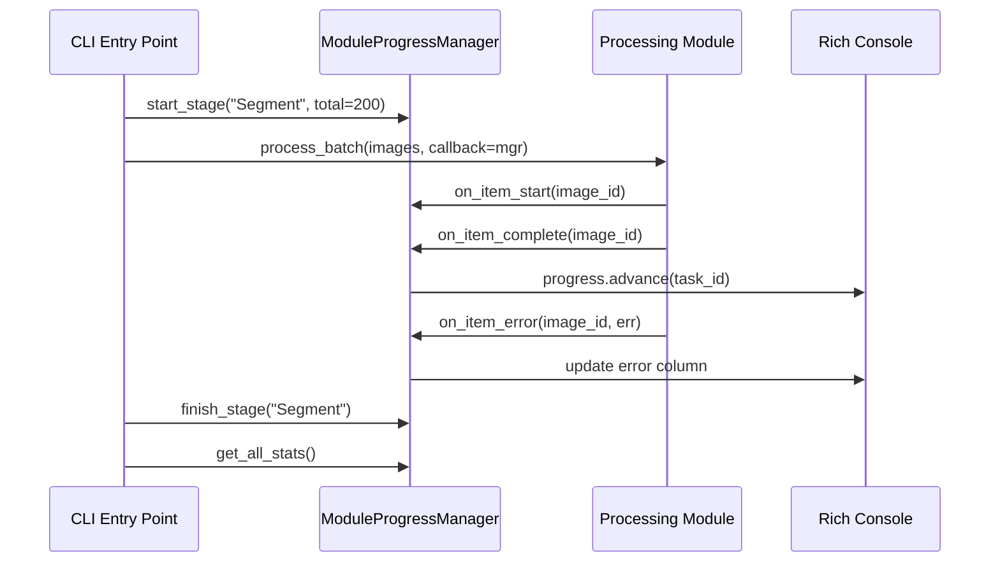

# `src/progress_display.py` — Progress Display Module

## Purpose

Provides an ephemeral Rich-based progress-bar display for the pipeline.
`ModuleProgressManager` implements the `ProgressCallback` Protocol from
`src/interfaces.py`, so it can be subscribed to any module that emits
progress events.

Durable persistence is handled separately by `ProgressTracker` (SQLite).
This module only shows live terminal feedback.

---

## Public API

### `PIPELINE_STAGES`

Ordered list of all pipeline stage names:

```python
["Scan", "Preprocess", "Segment", "Remap", "NMS", "Filter", "Annotate", "Upload", "Validate"]
```

### `StageProgress` (dataclass)

Per-stage statistics container.

| Field | Type | Description |
|-------|------|-------------|
| `stage_name` | `str` | Name of the stage |
| `total` | `int` | Expected total items |
| `completed` | `int` | Items completed successfully |
| `errors` | `int` | Items that raised errors |
| `start_time` | `float` | `time.monotonic()` when stage started |
| `task_id` | `Optional[Any]` | Rich `TaskID` for the progress bar task |
| `active` | `bool` | Whether the stage is currently running |

Computed properties: `elapsed: float`, `throughput: float` (items/s), `eta_str: str`.

### `ModuleProgressManager`

Rich-based thread-safe progress display.

```python
mgr = ModuleProgressManager(active_stage=None, show_gpu_memory=True)
```

#### Lifecycle

| Method | Description |
|--------|-------------|
| `start()` | Start the Rich Live context |
| `stop()` | Stop the Rich Live context |
| `__enter__` / `__exit__` | Context-manager support |

#### Stage management

| Method | Description |
|--------|-------------|
| `start_stage(name, total)` | Register + display a stage; raises `ValueError` for unknown stage names |
| `finish_stage(name)` | Mark stage as inactive; silently ignores unknown names |

#### `ProgressCallback` Protocol methods

| Method | Description |
|--------|-------------|
| `on_item_start(item_id)` | Mark item as in-flight |
| `on_item_complete(item_id)` | Increment completed counter for the active stage |
| `on_item_error(item_id, error)` | Increment error counter for the active stage |

#### Stage-targeted callbacks (bypass active_stage)

| Method | Description |
|--------|-------------|
| `on_stage_item_complete(stage_name, item_id)` | Target a specific stage directly |
| `on_stage_item_error(stage_name, item_id, error)` | Target a specific stage directly |

#### Stats

| Method | Returns | Description |
|--------|---------|-------------|
| `get_stage_stats(stage_name)` | `Optional[Dict]` | Stats for one stage; `None` if stage not started |
| `get_all_stats()` | `Dict[str, Dict]` | All stages with stats |
| `reset_stats()` | None | Clear all stage state |

---

## Design

- Thread-safe via `threading.Lock` around all counter mutations
- Gracefully degrades when `rich` is not installed (no display, stats still work)
- `active_stage` determines which stage `on_item_*` events route to
- Stage-specific `on_stage_item_*` methods bypass `active_stage` for multi-stage concurrent tracking
- `StageProgress` is a dataclass (not a Protocol) — it is an internal implementation detail

---

## Dependencies

- **Implements**: `ProgressCallback` Protocol from `src/interfaces.py`
- **Consumes**: No config slice (display-only; not a processing module)
- **Imports**: `src.logging_system`, `src.interfaces.ProgressCallback`, `src.utils.estimate_eta`, `threading`, `time`, `dataclasses`, `typing`; optional `rich`

---

## Data Flow



---

## Usage Examples

```python
from src.progress_display import ModuleProgressManager

with ModuleProgressManager() as mgr:
    mgr.start_stage("Segment", total=100)
    for img in images:
        mgr.on_item_start(img)
        try:
            process(img)
            mgr.on_item_complete(img)
        except Exception as e:
            mgr.on_item_error(img, e)
    mgr.finish_stage("Segment")
    stats = mgr.get_all_stats()

# As ProgressCallback injection
def process_batch(images, callback: ProgressCallback):
    for img in images:
        callback.on_item_start(img)
        ...

process_batch(images, callback=mgr)
```

---

## Edge Cases

- `start_stage` raises `ValueError` if stage name not in `PIPELINE_STAGES`
- `finish_stage` silently ignores unknown stage names
- `on_item_*` with no active stage logs a warning and does nothing
- Rich not installed → no terminal output; stats still accumulate correctly
- Thread safety: `threading.Lock` protects all `StageProgress` mutations

---

## Wiring

- **CLI**: Each CLI entry point creates a `ModuleProgressManager`, calls `start_stage()` before its loop, `finish_stage()` after
- **Config read**: None — display only
- **Pipeline stage**: Not a pipeline stage; subscribed to other stages as a `ProgressCallback`
- **ProgressTracker**: Orthogonal — `ProgressTracker` persists to SQLite; `ModuleProgressManager` renders ephemeral UI

---

## Phase 3 — Created by Agent B

**Date:** 23-02-2026  
**Status:** Delivered ✅

### Test Results

```
pytest tests/test_progress_display.py -v
========================= 40 passed in 0.98s =========================
```
