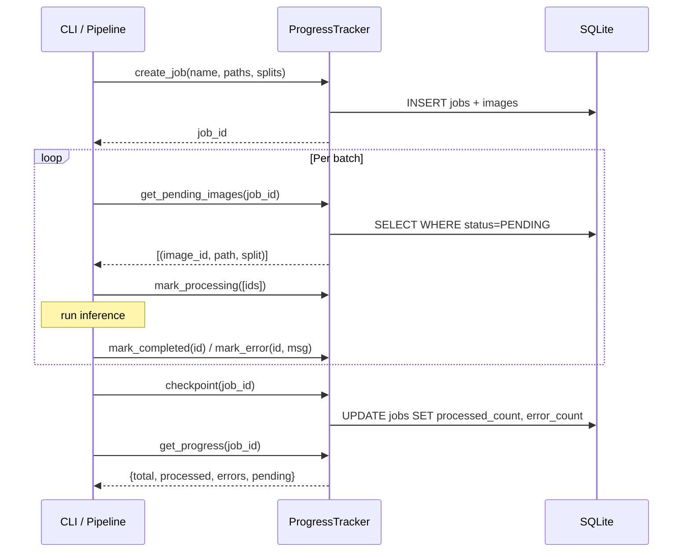

# progress_tracker

## Purpose

Durable SQLite-backed progress tracking for long-running pipeline jobs.
Records per-image processing status (pending / processing / completed / error),
accumulates job-level counters, and supports resume-from-checkpoint workflow.

## Public API

### `ProgressTracker`

| Method | Signature | Description |
|--------|-----------|-------------|
| `__init__` | `(db_path: Path)` | Open (or create) the SQLite DB in WAL mode |
| `create_job` | `(name: str, image_paths: List[Path], splits: List[str]) → int` | Insert job + all images; returns `job_id` |
| `get_job_id` | `(name: str) → Optional[int]` | Look up job by name |
| `get_pending_images` | `(job_id: int, limit: int = 100) → List[Tuple[int, Path, str]]` | Fetch unprocessed images as `(image_id, path, split)` |
| `mark_processing` | `(image_ids: List[int]) → None` | Transition images to `PROCESSING` |
| `mark_completed` | `(image_id: int) → None` | Transition one image to `COMPLETED` |
| `mark_error` | `(image_id: int, error_msg: str) → None` | Transition one image to `ERROR` |
| `checkpoint` | `(job_id: int) → None` | Recompute and persist job-level `processed_count` / `error_count` |
| `get_progress` | `(job_id: int) → Dict[str, Any]` | Return `{total_images, processed_count, error_count, pending_count}` |
| `reset_stuck_images` | `(job_id: int) → int` | Reset `PROCESSING` → `PENDING` (resume from crash) |
| `close` | `() → None` | Close the DB connection |

### `Status` enum

Values: `PENDING`, `PROCESSING`, `COMPLETED`, `ERROR`

## Design

- **WAL mode** + `synchronous=NORMAL` + `cache_size=-64000` + `busy_timeout=300000` ms
- Thread-local `threading.local()` connections for multi-threaded use.
- Exponential backoff retry (5 retries, 0.5 s doubling) on `OperationalError`.
- `checkpoint()` must be called periodically to flush image-level counts into the `jobs` table — `get_progress()` reads from `jobs`, not from the `images` table.
- Images inserted with `INSERT OR IGNORE` so re-running `create_job` is idempotent.

## Dependencies

- Implements: `Tracker` protocol from `src/interfaces.py`
- Imports: `sqlite3`, `pathlib`, `threading`, `datetime`, `src.logging_system`

## Data Flow



## Usage Examples

```python
from src.progress_tracker import ProgressTracker
from pathlib import Path

tracker = ProgressTracker(db_path=Path("logs/pipeline.db"))
job_id = tracker.create_job("batch_001", image_paths, splits)

pending = tracker.get_pending_images(job_id, limit=500)
for (image_id, path, split) in pending:
    try:
        result = segmentor.process(path)
        tracker.mark_completed(image_id)
    except Exception as e:
        tracker.mark_error(image_id, str(e))

tracker.checkpoint(job_id)
progress = tracker.get_progress(job_id)
print(f"{progress['processed_count']}/{progress['total_images']}")

tracker.close()
```

## Edge Cases

- `get_progress` returns `{}` if `job_id` doesn't exist
- Counts in `get_progress` reflect the last `checkpoint()` call — not real-time
- `reset_stuck_images` should be called on pipeline restart to recover from crash

## Wiring

- Created by: `src/cli/pipeline.py`, `src/cli/progress.py`
- Config source: `config.progress.db_path`
- Pipeline stage: `[Segment]`, `[Annotate]`, `[Upload]` (all stages use tracking)

## Phase 7 — Audit Compliance

**Date:** 25-02-2026

### Changes

- Added `trace` import from `src.logging_system`
- Renamed `logger` → `_logger` (private convention)
- Added `@trace` decorator to Protocol methods: `create_job`, `mark_completed`, `mark_error`, `checkpoint`, `get_progress`
- Added return type annotations to: `mark_completed`, `mark_error`, `checkpoint`, `mark_processing`, `mark_batch_uploaded`, `mark_batch_error`, `reset_processing_images`, `close`, `_init_db`
- Converted all f-string logging to lazy `%s` formatting
