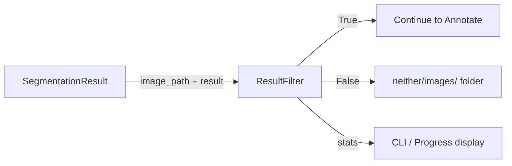

# result_filter

## Purpose

Post-segmentation filter that categorises images by whether they contain valid
detections.  Images with no detections are routed to a "neither" folder so they
can be reviewed separately.

## Public API

### `FilterStats` (dataclass)

| Field | Type | Description |
|-------|------|-------------|
| `total_processed` | int | Total images evaluated |
| `with_detections` | int | Images that passed (had detections) |
| `no_detections` | int | Images routed to "neither" |

### `ResultFilter`

| Method | Signature | Description |
|--------|-----------|-------------|
| `__init__` | `(pipeline_config)` | ISP: reads `pipeline_config.output_dir`, `pipeline_config.neither_dir` |
| `filter_result` | `(image_path: Path, result, copy_to_neither=True) → bool` | Returns `True` = kept, `False` = routed to neither |
| `get_stats` | `() → Dict[str, Any]` | Return `FilterStats` as dict |
| `get_filtered_images` | `() → List[Path]` | Paths of all images routed to neither |
| `get_neither_count` | `() → int` | Number of "neither" images |
| `write_neither_manifest` | `(manifest_path: Path) → None` | Write list of neither image paths to file |
| `reset_stats` | `() → None` | Zero all counters and clear the filtered images list |

## Design

- **ISP**: receives `pipeline_config` with only `output_dir` and `neither_dir`.
- Duck-typed `result` argument: checks `result.num_detections` first; falls back
  to `result.masks` + `result.class_ids` if `num_detections` is absent.
- `copy_to_neither=False` prevents file I/O during testing.

## Dependencies

- Implements: `Filter` protocol from `src/interfaces.py`
- Imports: `shutil`, `pathlib`, `src.logging_system`
- Config consumed: `pipeline_config.output_dir`, `pipeline_config.neither_dir`

## Data Flow



## Usage Examples

```python
from src.result_filter import ResultFilter

result_filter = ResultFilter(config.pipeline)
kept = result_filter.filter_result(
    image_path=Path("data/img001.jpg"),
    result=seg_result,      # duck-typed; needs .num_detections or .masks
    copy_to_neither=True,
)
if not kept:
    print("image has no detections, moved to neither/")
    
stats = result_filter.get_stats()
result_filter.write_neither_manifest(Path("logs/neither_images.txt"))
```

## Edge Cases

- `result=None` is treated as "no detections" → `False`
- If `result.class_ids` is an empty list, returns `False`
- `_move_to_neither` copies (not moves) to preserve original data

## Wiring

- Created by: `src/cli/filter.py` via `ResultFilter(config.pipeline)`
- Pipeline stage: `[Filter]` in `src/pipeline.py` (runs after `[NMS]`)
- Config source: `config.pipeline.neither_dir`

## Phase 7 — Audit Compliance

**Date:** 25-02-2026

### Changes

- Added `trace` import from `src.logging_system`
- Renamed `logger` → `_logger` (private convention)
- Added `@trace` decorator to: `filter_result`, `get_stats`, `write_neither_manifest`, `reset_stats`
- Added `-> None` return type to `reset_stats`
- Added `pipeline_config: object` type hint to `__init__`
- Converted all f-string logging to lazy `%s` formatting
