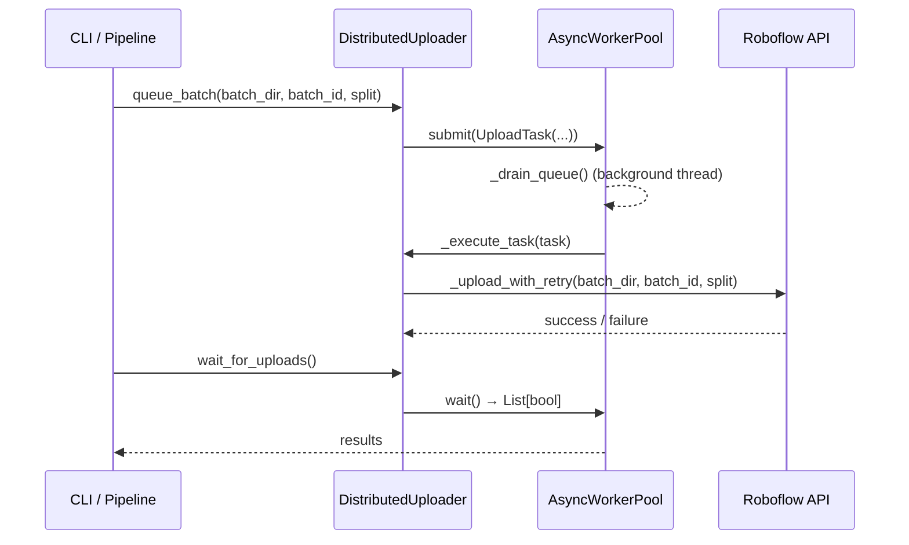

# roboflow_uploader

## Purpose

Asynchronous batch uploader for Roboflow datasets.  Implements SOLID OCP and
SRP by splitting the async worker queue into `AsyncWorkerPool` (generic,
reusable) and `DistributedUploader` (Roboflow-specific batching logic).

## Public API

### `AsyncWorkerPool`

Generic task queue backed by a background `Thread` + `ThreadPoolExecutor`.

| Method | Signature | Description |
|--------|-----------|-------------|
| `__init__` | `(max_workers: int, task_fn: Callable)` | Create pool with a task handler function |
| `submit` | `(task: Any) → None` | Enqueue a task for async execution |
| `wait` | `(timeout: Optional[float] = None) → List[bool]` | Block until all tasks complete; return results |
| `get_stats` | `() → Dict[str, Any]` | Return `{submitted, completed, failed, pending}` |
| `shutdown` | `(wait: bool = True) → None` | Stop the drain thread and executor |

### `UploadTask` (dataclass)

Fields: `batch_dir: Path`, `batch_id: str`, `split: str`

### `DistributedUploader`

| Method | Signature | Description |
|--------|-----------|-------------|
| `__init__` | `(config: RoboflowConfig)` | ISP: receives only `config.roboflow` |
| `queue_batch` | `(batch_dir: Path, batch_id: str, split: str) → None` | Enqueue a batch for async upload |
| `wait_for_uploads` | `(timeout: Optional[float] = None) → List[bool]` | Block until all queued batches complete |
| `get_stats` | `() → Dict[str, Any]` | Delegate to `AsyncWorkerPool.get_stats()` |
| `shutdown` | `(wait: bool = True) → None` | Graceful shutdown |
| `retry_failed_batches` | `() → None` | Re-queue all previously failed batches |
| `upload_neither_folder` | `(neither_dir: Path) → None` | Upload "neither" images to a separate project |
| `should_upload_neither` | `() → bool` | Check if neither upload is configured |

## Design

- **SRP**: `AsyncWorkerPool` owns the Queue+Thread+Executor; `DistributedUploader`
  owns Roboflow-specific upload logic and adapts it via `_execute_task()`.
- **OCP**: `AsyncWorkerPool` is generic — new uploaders can reuse it by passing
  a different `task_fn`.
- `_execute_task(task) → bool` is the adapter that bridges `AsyncWorkerPool` to
  `_upload_with_retry(batch_dir, batch_id, split)`.

## Dependencies

- Implements: `Uploader` protocol from `src/interfaces.py`
- Imports: `roboflow`, `queue`, `threading`, `concurrent.futures`, `src.logging_system`
- Config consumed: `RoboflowConfig` (api_key, workspace, project, upload_workers, batch_size)

## Data Flow



## Usage Examples

```python
from src.roboflow_uploader import DistributedUploader

uploader = DistributedUploader(config.roboflow)
uploader.queue_batch(Path("output/train"), "batch_001", "train")
uploader.queue_batch(Path("output/valid"), "batch_002", "valid")

results = uploader.wait_for_uploads(timeout=300)
stats = uploader.get_stats()
print(f"Uploaded: {stats['completed']}, Failed: {stats['failed']}")

uploader.shutdown()
```

## Edge Cases

- `_upload_with_retry` retries up to `MAX_RETRIES` times with exponential backoff
- `retry_failed_batches()` re-enqueues only previously failed tasks
- `shutdown(wait=False)` discards pending tasks immediately

## Wiring

- Created by: `src/cli/upload.py` via `DistributedUploader(config.roboflow)`
- Pipeline stage: `[Upload]` in `src/pipeline.py`
- Config source: `config.roboflow` (api_key, workspace, project, upload_workers)
