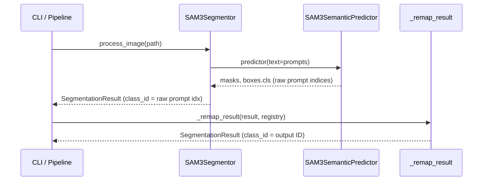

# `src/sam3_segmentor.py` — SAM 3 Segmentor Module

## Purpose

Wraps `SAM3SemanticPredictor` (ultralytics) to produce `SegmentationResult` objects from image files.  This module is responsible **only** for inference — NMS and class remapping are separate downstream pipeline stages.

## Public API

### `SAM3Segmentor`

```python
SAM3Segmentor(model_config: ModelConfig, pipeline_config: PipelineConfig)
```

| Method | Signature | Description |
|---|---|---|
| `process_image` | `(image_path: Path) → Optional[SegmentationResult]` | Segment one image; returns `None` if no masks detected |
| `process_batch` | `(image_paths: List[Path]) → List[Optional[SegmentationResult]]` | Iterate `process_image` over a list; errors are logged and return `None` |
| `get_device_info` | `() → Dict[str, Any]` | Return device, memory, and model-load state |
| `cleanup` | `() → None` | Release model resources and clear CUDA cache |

### `DeviceManager` (static helpers)

| Method | Description |
|---|---|
| `get_available_devices() → Dict` | Detect CUDA devices; recommended device |
| `resolve_device(device_config) → str` | Resolve `"auto"` / validate CUDA availability |
| `get_memory_info() → Dict` | CPU RAM + per-GPU memory stats |

### Factory

```python
create_segmentor(model_config, pipeline_config) → SAM3Segmentor
```

## Design

### Raw Prompt Indices

`process_image()` populates `MaskData.class_id` with the **raw SAM3 prompt index** — the integer returned by `result.boxes.cls`.  This is the index into `config.model.prompts` (0..N-1).

The pipeline remap stage (`SegmentationPipeline._remap_result`) calls `ClassRegistry.remap_prompt_index()` on each mask before NMS begins.

### Lazy Loading

`_ensure_loaded()` + `self._model_loaded` flag defer model loading until the first `process_image()` call.  This avoids model loading overhead during pipeline setup.

### Periodic GC

`_maybe_gc()` runs `gc.collect()` every 50 images (CPU) or 100 images (GPU), plus `torch.cuda.empty_cache()` on GPU.

## Dependencies

- **Implements:** `Segmentor` Protocol from `src/interfaces.py`
- **Config slices:** `ModelConfig` (`config.model`), `PipelineConfig` (`config.pipeline`)
- **Imports:** `src/logging_system.py`, `src/interfaces.py`
- **Requires:** `ultralytics>=8.3.237` with `SAM3SemanticPredictor`, CLIP fork

## Data Flow



## Usage Example

```python
from src.sam3_segmentor import create_segmentor, DeviceManager
from src.config_manager import load_config

config = load_config("config/config.yaml")
seg = create_segmentor(config.model, config.pipeline)
result = seg.process_image(Path("image.jpg"))
if result:
    print(f"Found {len(result.masks)} masks on {result.device}")
seg.cleanup()
```

## Edge Cases

| Condition | Behaviour |
|---|---|
| Image file not found | `FileNotFoundError` |
| `cv2.imread` returns None | `ValueError` |
| No masks detected | Returns `None` |
| SAM3 not installed | `ImportError` with install instructions |
| Model file missing | `RuntimeError` |

## Wiring

- **Created by:** `create_segmentor(config.model, config.pipeline)` in CLI / `parallel_processor.py` workers
- **Pipeline stage:** segment (stage 3 of 9)
- **Next stage:** `SegmentationPipeline._remap_result()` — converts raw prompt indices to output class IDs
- **NOTE:** `DeviceManager` will migrate to `src/gpu_strategy.py` in Phase 3

## Phase 7 — Audit Compliance

**Date:** 25-02-2026

### Changes

- Added `@trace` to `cleanup()` method (only missing decorator)
- All other methods already had `@trace`, `_logger`, and `LoggingSystem`
