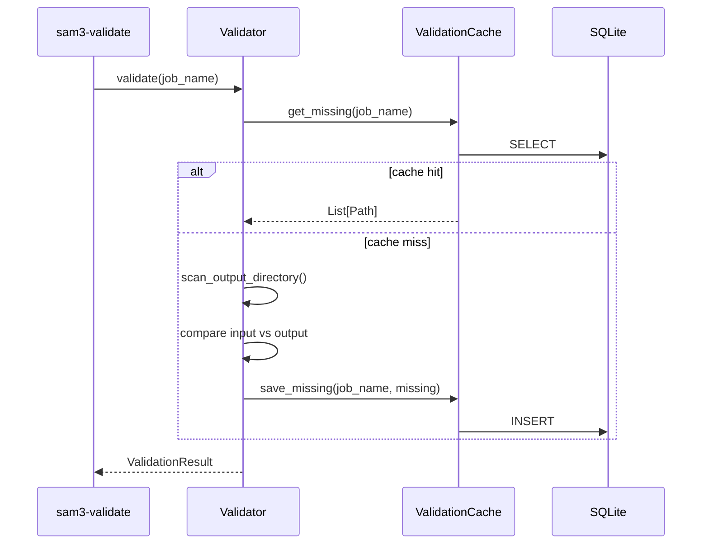

# validator

## Purpose

Validates dataset completeness by comparing input images to processed output
annotations.  Implements SRP via two classes:
- **`ValidationCache`** — SQLite persistence for missing-image lists
- **`Validator`** — pure scan/compare logic; delegates cache I/O to `ValidationCache`

## Public API

### `ValidationResult` (dataclass)

| Field / Property | Type | Description |
|-----------------|------|-------------|
| `input_count` | int | Total source images found |
| `output_count` | int | Total annotated images found |
| `missing_images` | List[Path] | Paths present in input but absent in output |
| `missing_by_split` | Dict[str, List[Path]] | Per-split breakdown |
| `missing_count` | int (property) | `len(missing_images)` |
| `is_complete` | bool (property) | `missing_count == 0` |
| `summary()` | str | Human-readable summary block |

### `ValidationCache`

| Method | Signature | Description |
|--------|-----------|-------------|
| `__init__` | `(db_path: Path)` | Open (or create) validation cache table |
| `save_missing` | `(job_name: str, missing: List[Path]) → None` | Persist missing paths for a job |
| `get_missing` | `(job_name: str) → Optional[List[Path]]` | Retrieve previously cached missing list |
| `invalidate` | `(job_name: str) → None` | Delete cache entry for a job |
| `close` | `() → None` | Close DB |

### `Validator`

| Method | Signature | Description |
|--------|-----------|-------------|
| `__init__` | `(pipeline_config, db_path: Path)` | ISP: receives only `pipeline_config`, not full `Config` |
| `validate` | `(job_name: str) → ValidationResult` | Scan directories, compare, cache, return result |
| `scan_output_directory` | `(output_dir: Path) → Dict[str, Set[Path]]` | Return `{split: set_of_image_paths}` |
| `get_missing_images` | `(job_name: str) → List[Path]` | Retrieve from cache or re-scan |

## Design

- **SRP**: `ValidationCache` handles only DB I/O; `Validator` handles only scan and compare logic.
- **ISP**: `Validator(pipeline_config, db_path)` — receives the minimal needed inputs.
- Results are cached in SQLite so repeated calls are fast.
- Uses `sqlite3` WAL mode (shared with `ProgressTracker`).

## Dependencies

- Implements: `Validator`-equivalent (no formal Protocol yet in `interfaces.py`)
- Config consumed: `pipeline_config.input_dir`, `pipeline_config.output_dir`
- Imports: `sqlite3`, `pathlib`, `src.logging_system`

## Data Flow



## Usage Examples

```python
from src.validator import Validator
from pathlib import Path

validator = Validator(config.pipeline, db_path=Path("logs/pipeline.db"))
result = validator.validate(job_name="batch_001")

print(result.summary())
# Input images:  2400
# Output images: 2398
# Missing:       2

if not result.is_complete:
    for path in result.missing_images:
        print(f"  Missing: {path}")
```

## Edge Cases

- `validate` re-uses cached missing list if already computed for the same `job_name`
- Empty output directories produce `missing_count == input_count`
- `scan_output_directory` returns `{}` if `output_dir` does not exist

## Wiring

- Created by: `src/cli/validate.py` via `Validator(config.pipeline, config.progress.db_path)`
- Pipeline stage: `[Validate]` (optional, at end of pipeline)
- Config source: `config.pipeline.input_dir`, `config.pipeline.output_dir`, `config.progress.db_path`
